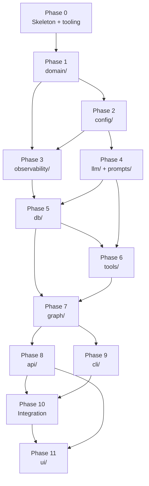

# Implementation Phases

**Scope:** entire repository.

Every implementation — initial build, new capability, refactor — **must** follow the phase model below. Phases are ordered by the module dependency graph in [`spec/product/02-architecture.md`](../product/02-architecture.md#module-dependency-graph). A phase is not complete until its gate criteria (tests passing, working tree clean) are satisfied.

---

## Why phases?

- **Fast feedback.** Each phase produces a working, tested slice of the system. Problems are found where they originate, not at final integration.
- **Dependency safety.** A higher-level module (e.g. `graph/`) is never built before the modules it depends on are tested and green.
- **Reversibility.** A phase that fails its gate is reverted or fixed in isolation. It does not block other phases that are not downstream of it.

---

## Phase dependency map

---

## Phase definitions

### Phase 0 — Skeleton and tooling

**Deliverables:**
- Repository structure: `src/zer0/`, `tests/`, `spec/`, `reports/`, `config/`.
- `pyproject.toml` with all runtime + dev dependencies declared.
- `__version__` in `src/zer0/__init__.py`.
- Ruff and mypy configured; CI can lint and type-check.

**Gate:** `pytest tests/unit/test_smoke.py` passes. Linter clean.

---

### Phase 1 — `domain/`

**What:** All Pydantic models for every business noun. No I/O, no DB, no LLM.

**Deliverables:**
- `domain/config.py` — `ICP`, `QualificationConfig`, `OutreachConfig`, `ResolvedConfig`, and all supporting models.
- `domain/lead.py` — `LeadStage`, `RawLead`, `EnrichedLead`, `QualifiedLead`, `RejectedLead`.
- `domain/outreach.py` — `MessageStatus`, `Sentiment`, `OutreachDraft`, `SentMessage`, `Reply`.

**Gate:** `pytest tests/unit/domain/` passes. All models validate on construction with valid inputs; invalid inputs raise `ValidationError`.

---

### Phase 2 — `config/`

**What:** Environment-variable reading and config resolution. No network I/O.

**Deliverables:**
- `config/settings.py` — `Settings` (`ZER0_` prefix, pydantic-settings).
- `config/resolver.py` — `ConfigResolver.resolve(campaign_id, tenant_id) → ResolvedConfig`.

**Dependencies:** Phase 1 (`domain/`).

**Gate:** `pytest tests/unit/config/` passes. `Settings` raises on missing required vars (tested with monkeypatch). `ConfigResolver` merges campaign → offering → tenant with a mock DB session.

---

### Phase 3 — `observability/`

**What:** Structured logging, Slack poster, audit event writer.

**Deliverables:**
- `observability/events.py` — `write_event()`, `post_slack_event()`, `configure_logging()`.

**Dependencies:** Phase 1 (`domain/`).

**Gate:** `pytest tests/unit/observability/` passes. `write_event` with `db=None` emits a log line without raising. `post_slack_event` with a mock httpx client posts the expected payload.

---

### Phase 4 — `llm/` + `prompts/`

**What:** LLM client wrapper and prompt loading from markdown files.

**Deliverables:**
- `llm/client.py` — `LLMClient`, `load_prompt()`, `generate()`, `generate_structured()`.
- `prompts/researcher.md`, `prompts/qualifier.md`, `prompts/outreach.md`, `prompts/planner.md`.

**Dependencies:** Phase 2 (`config/`).

**Gate:** `pytest tests/unit/llm/` passes. `load_prompt` substitutes all declared variables; raises on undeclared variable. `LLMClient.generate` is tested against a mocked Anthropic SDK response.

---

### Phase 5 — `db/`

**What:** SQLAlchemy ORM models, session factory, and Alembic migration.

**Deliverables:**
- `db/models.py` — all ORM table classes.
- `db/session.py` — `get_session()` generator.
- `alembic/` — `env.py`, `versions/0001_initial.py`.

**Dependencies:** Phases 1 and 2.

**Gate:** `pytest tests/unit/db/` passes. Schema can be created against a test SQLite database (no Postgres required). All ORM models are importable and have the expected columns.

---

### Phase 6 — `tools/`

**What:** All 13 tool functions.

**Deliverables:** Every file in `tools/` — one per tool as listed in `spec/product/02-architecture.md`.

**Dependencies:** Phases 1 (`domain/`), 3 (`observability/`), 4 (`llm/`).

**Gate:** `pytest tests/unit/tools/` passes. Every tool has at minimum:
- One test of the happy path with mocked external I/O (httpx, Anthropic SDK, Gmail).
- One test of the primary failure mode (API error, parse error).

---

### Phase 7 — `graph/`

**What:** LangGraph state machine — state schema, nodes, conditional edges, compiled agent, runner.

**Deliverables:**
- `graph/state.py`, `graph/nodes.py`, `graph/edges.py`, `graph/agent.py`, `graph/runner.py`.

**Dependencies:** Phases 1, 3, 4, 5, 6.

**Gate:** `pytest tests/unit/graph/` passes. Every edge routing function is unit-tested. `build_graph()` compiles without error. `run_campaign` end-to-end test drives the graph with all tools stubbed and asserts final state fields.

---

### Phase 8 — `api/`

**What:** FastAPI route modules — the backend for the web dashboard.

**Deliverables:** All route modules under `api/` — health, auth, tenant, offerings, campaigns, leads, approvals, messages, events.

**Dependencies:** Phases 1, 5, and 7.

**Gate:** `pytest tests/integration/test_api.py` passes with FastAPI `TestClient`. Every route has:
- A 2xx test on a valid request.
- A 4xx test on an invalid/unauthorised request.

---

### Phase 9 — `cli/`

**What:** Click command group — local dev and admin commands.

**Deliverables:** All commands in `cli/` as defined in `spec/product/06-cli.md`.

**Dependencies:** Phases 2, 5, and 7.

**Gate:** `pytest tests/unit/cli/` passes with Click's `CliRunner`. Every command has an exit-code test on the happy path and on an invalid argument.

---

### Phase 10 — Integration

**What:** End-to-end integration tests. No new source code.

**Deliverables:** `tests/integration/test_e2e.py` — full campaign run from `run_campaign()` through to DB assertions with all external calls stubbed.

**Dependencies:** All prior phases.

**Gate:** All tests pass (`pytest tests/`). Linter and type-checker clean. Working tree clean.

---

### Phase 11 — `ui/`

**What:** Operator web dashboard — Next.js 15 (static export) served by the FastAPI backend.

**Spec:** [`spec/product/11-ui-dashboard.md`](../product/11-ui-dashboard.md)

**Deliverables:**
- `ui/` at repo root — Next.js 15 project (TypeScript, Tailwind CSS 4).
- All screens listed in `11-ui-dashboard.md`: dashboard home, tenant onboarding wizard, lead pipeline, lead detail, approval queue, campaign builder, offering editor, operator settings.
- `ui/out/` static export bundled into the Python package.
- `tests/unit/ui/` — component-level tests for every form and state transition (Vitest + React Testing Library).

**Dependencies:** Phase 8 (`api/`) — the UI is a client of the existing REST API. No new Python code in this phase.

**Gate:**
- `npm test` (Vitest) passes for all UI component tests.
- `npm run build` produces a clean `ui/out/` export with no TypeScript errors.
- Every screen in the screen map (`11-ui-dashboard.md`) renders and submits against a mock API server.
- Secret fields (`type=password`) never appear in component snapshots with pre-filled values.

---

## Rules for AI agents

1. **Never skip a phase.** Build and test each layer before the layer above it.
2. **Gate before proceeding.** The gate test(s) for a phase must be green before any code in the next phase is written. If the gate is red, fix it in the current phase — do not carry broken code forward.
3. **One commit per phase.** When a phase gate passes, commit with the prefix `phase-N:` (e.g. `phase-1: domain models + tests`). Ref the spec file in the commit body.
4. **Tests travel with code.** Tests for a phase are added in the same commit as the phase's source code. A commit that adds `tools/qualify_lead.py` without `tests/unit/tools/test_qualify_lead.py` fails the gate.
5. **Backfilling is allowed but flagged.** If a module was implemented out of order (e.g. in the initial bulk implementation), the next PR must add the missing phase tests before adding new code that depends on that module.

---

## Adding a new capability

When adding a new feature:

1. Identify which phase(s) it touches.
2. Add tests to those phases' test directories.
3. Ensure all prior-phase gates are still green.
4. If the new capability spans multiple phases, split into one commit per phase.
