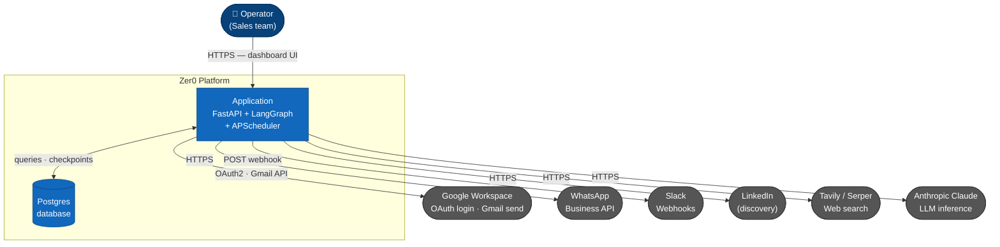
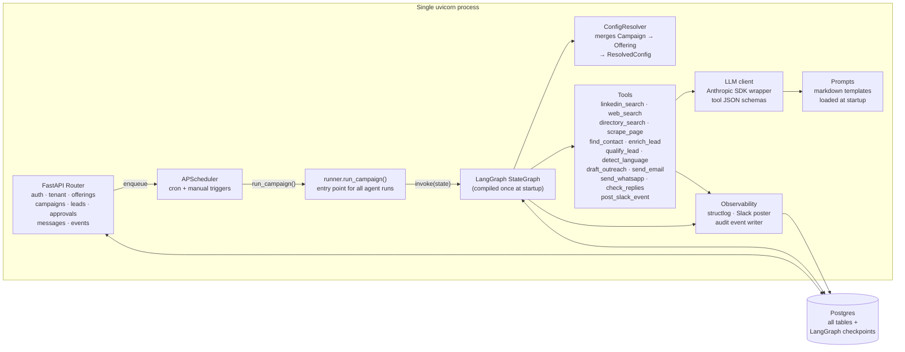
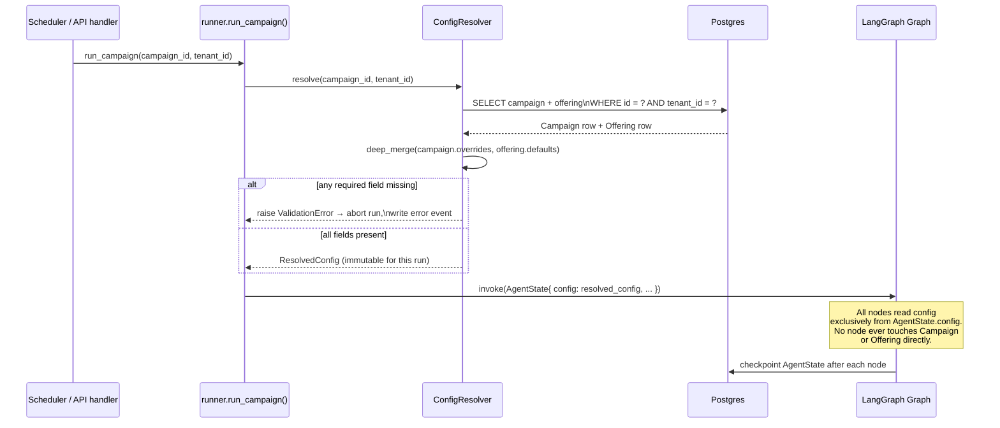

# Architecture

Status: DRAFT

## System context

Every actor and external system that Zer0 touches at runtime.



**Boundary notes:**
- The operator web dashboard (Next.js SPA — see [`11-ui-dashboard.md`](11-ui-dashboard.md)) communicates with `App` over HTTPS REST via the `/api/v1` routes.
- All outbound calls from `App` to external APIs are made using tenant-scoped credentials stored encrypted in Postgres. No credential is shared across tenants.
- LinkedIn is a discovery-only source in v1. DM outreach (write access) is deferred to v2.

---

## Deployment topology

In v1, the entire application runs as **one Python process** (uvicorn). APScheduler is embedded in the same process. LangGraph runs in-process, invoked by the scheduler or directly by an API handler.



**Scaling note (future):** if campaign volume grows, `Runner` can be moved to a separate worker process with a task queue (Celery/ARQ) between the API and the workers. The interface (`run_campaign(campaign_id, tenant_id)`) does not change.

---

## Layered src structure

```
┌──────────────────────────────────────────────┐
│               API / CLI                      │  ← FastAPI (dashboard backend) + click (local)
├──────────────────────────────────────────────┤
│                  GRAPH                       │  ← langgraph: state, nodes, edges
├──────────────────────────────────────────────┤
│   TOOLS       │    LLM      │    MEMORY      │  ← typed functions / model client / checkpointing
├──────────────────────────────────────────────┤
│             DOMAIN MODELS                    │  ← pydantic: business nouns
└──────────────────────────────────────────────┘
```

### Module responsibilities

| Module           | Responsibility                                                                  |
| ---------------- | ------------------------------------------------------------------------------- |
| `domain/`        | Pydantic models for every business noun.                                        |
| `tools/`         | Typed tool functions — one file per tool.                                       |
| `llm/`           | Model client + tool JSON schemas.                                               |
| `graph/`         | State machine, nodes, conditional edges, compiled runtime.                      |
| `memory/`        | Checkpointing — persists loop state across runs.                                |
| `prompts/`       | Markdown templates loaded at runtime. All prompt variables are config-injected. |
| `observability/` | Structured logs, Slack event posting, audit trail writer.                       |
| `api/`           | FastAPI routes — the backend for the web dashboard.                             |
| `cli/`           | Click commands — local dev and admin.                                           |
| `config/`        | pydantic-settings, loaded from `.env`. System-level secrets only.               |

### Module dependency graph

Arrows represent import direction. `domain/` has no dependencies inside `src/` — it is the foundation every other module builds on.

```mermaid
flowchart TD
    api["api/\nFastAPI routes"]
    cli["cli/\nClick commands"]
    graph["graph/\nStateGraph · nodes · edges · runner"]
    tools["tools/\none file per tool"]
    llm["llm/\nmodel client · tool schemas"]
    memory["memory/\nPostgresSaver checkpointer"]
    prompts["prompts/\nmarkdown templates"]
    observability["observability/\nstructlog · Slack · audit writer"]
    domain["domain/\nPydantic models"]
    config_mod["config/\npydantic-settings"]

    api           --> graph
    api           --> domain
    cli           --> graph
    graph         --> tools
    graph         --> llm
    graph         --> memory
    graph         --> observability
    graph         --> domain
    tools         --> llm
    tools         --> observability
    tools         --> domain
    llm           --> prompts
    llm           --> config_mod
    observability --> domain
    config_mod    --> domain

    style domain     fill:#1168bd,color:#fff,stroke:#0b4884
    style config_mod fill:#444444,color:#fff,stroke:#222222
```

**Key constraints:**
- `domain/` imports nothing from this repo.
- `tools/` does not import from `graph/` — tools are called by nodes, not the reverse.
- `api/` does not import from `tools/` directly — all tool execution goes through the graph.

---

## Configuration resolution

Every agent behaviour is driven by resolved configuration. The resolution order is:

```
Campaign override → Offering default → validation error (never a silent system default)
```

The `ConfigResolver` service is called at the start of every agent tick. It merges `Campaign` overrides onto `Offering` defaults and returns a fully-resolved `ResolvedConfig` model. The agent operates exclusively from `ResolvedConfig` — it never reads `Campaign` or `Offering` fields directly during a run.

This means: change any field in the dashboard → it is picked up on the next tick, with no restart.

### Config resolution sequence



---

## Multi-tenancy

Tenant ID is a non-nullable foreign key on every database table. The API enforces tenant scoping on every request via middleware — no query ever runs without a tenant filter. No data crosses tenant boundaries.

---

## Domain models

### Configuration hierarchy

| Model               | Key fields                                                                                                     |
| ------------------- | -------------------------------------------------------------------------------------------------------------- |
| `Tenant`            | id, name, google_oauth_token, whatsapp_api_key, slack_webhook_url, notification_rules, retargeting_policy      |
| `Offering`          | id, tenant_id, name, description, value_proposition, pain_points, discovery_config, icp, qualification_config, outreach_config |
| `Campaign`          | id, tenant_id, offering_id, name, discovery_override, icp_override, qualification_override, outreach_override, schedule, volume_cap, approval_mode, status |
| `ResolvedConfig`    | Fully merged config — the only config object the agent reads during a run. Never persisted; computed on each tick. |

### Granular config models (embedded in Offering / Campaign)

| Model                  | Key fields                                                                                            |
| ---------------------- | ----------------------------------------------------------------------------------------------------- |
| `DiscoveryConfig`      | sources (linkedin, web, directories), query_templates, geography, volume_per_run                      |
| `ICP`                  | target_industries, target_roles, company_size_range, geography, keywords, negative_keywords           |
| `QualificationConfig`  | rubric_criteria ([{name, description, weight}]), score_threshold, disqualifying_signals               |
| `OutreachConfig`       | channels_enabled, tone, language_default, templates ({first_touch, follow_up_1..N}), follow_up_count, follow_up_spacing_days, send_schedule |

### Lead pipeline models

| Model             | Key fields                                                                                   |
| ----------------- | -------------------------------------------------------------------------------------------- |
| `RawLead`         | id, campaign_id, name, company, url, source                                                  |
| `EnrichedLead`    | RawLead + company_summary, role_summary, recent_signals, detected_language                   |
| `QualifiedLead`   | EnrichedLead + score, per_criterion_scores, rationale                                        |
| `RejectedLead`    | EnrichedLead + rejection_reason, per_criterion_scores                                        |
| `OutreachDraft`   | lead_id, channel, subject (email only), body, personalisation_notes, config_snapshot         |
| `SentMessage`     | OutreachDraft + sent_at, message_id, sequence_number                                         |
| `Reply`           | lead_id, channel, content, received_at, sentiment                                            |

`config_snapshot` on `OutreachDraft` records the exact `ResolvedConfig` used to generate that message — so the audit log shows not just what was sent but what configuration drove it.

---

## Control flow

```
┌──────────────────────┐
│   Campaign trigger   │  ← cron schedule or manual kick from dashboard
└──────────┬───────────┘
           │
┌──────────▼───────────┐
│   ConfigResolver     │  ← merge Campaign overrides onto Offering defaults → ResolvedConfig
└──────────┬───────────┘
           │
┌──────────▼───────────┐
│      discover        │  ← ResolvedConfig.discovery_config → [RawLead]
└──────────┬───────────┘
           │  (per lead)
┌──────────▼───────────┐
│      research        │  ← ResolvedConfig.icp signals → EnrichedLead
└──────────┬───────────┘
           │
┌──────────▼───────────┐
│      qualify         │  ← ResolvedConfig.qualification_config → QualifiedLead | RejectedLead
└──────────┬───────────┘
           │
┌──────────▼───────────┐
│   approval gate      │  ← ResolvedConfig.approval_mode → auto-pass or wait for human
└──────────┬───────────┘
           │  (approved leads only)
┌──────────▼───────────┐
│      outreach        │  ← ResolvedConfig.outreach_config → OutreachDraft → SentMessage
└──────────┬───────────┘
           │
┌──────────▼───────────┐
│   follow-up loop     │  ← waits follow_up_spacing_days, sends up to follow_up_count times
└──────────┬───────────┘
           │  (on positive reply)
┌──────────▼───────────┐
│      handoff         │  ← flag Responded, post Slack alert, stop outreach
└──────────────────────┘
```

Every node reads only from `ResolvedConfig`. No node has hardcoded behaviour.

---

## Tools

| Tool                | Input                      | Output                          | Notes                                              |
| ------------------- | -------------------------- | ------------------------------- | -------------------------------------------------- |
| `linkedin_search`   | DiscoveryConfig + ICP      | [RawLead]                       | Searches LinkedIn for matching companies/contacts. |
| `web_search`        | DiscoveryConfig + ICP      | [RawLead]                       | Keyword search via Tavily/Serper.                  |
| `directory_search`  | DiscoveryConfig + ICP      | [RawLead]                       | IndiaMART/Justdial fallback.                       |
| `scrape_page`       | URL                        | cleaned page text               | Extracts readable content.                         |
| `find_contact`      | company URL + ICP.roles    | name, email, phone, role        | Finds decision-maker contact details.              |
| `enrich_lead`       | RawLead + ICP              | EnrichedLead                    | Combines scrape + LLM summarisation.               |
| `qualify_lead`      | EnrichedLead + QualificationConfig | QualifiedLead \| RejectedLead | Scores per rubric criteria via LLM.      |
| `detect_language`   | EnrichedLead               | language code                   | Infers best outreach language from lead profile.   |
| `draft_outreach`    | QualifiedLead + OutreachConfig | OutreachDraft               | Generates personalised message via LLM.            |
| `send_email`        | OutreachDraft + tenant creds | SentMessage                   | Sends via tenant's Google Workspace (OAuth).       |
| `send_whatsapp`     | OutreachDraft + tenant creds | SentMessage                   | Sends via WhatsApp Business API.                   |
| `check_replies`     | Campaign + OutreachConfig  | [Reply]                         | Polls for replies; classifies sentiment.           |
| `post_slack_event`  | event payload + tenant webhook | ack                         | Posts structured event to tenant's Slack.          |

Every tool receives its behavioural parameters from `ResolvedConfig`. No tool has hardcoded logic for a specific tenant or offering.

---

## Prompts

All prompts are markdown templates with `{{variable}}` placeholders. Variables are injected from `ResolvedConfig` at runtime — the offering's value proposition, pain points, ICP, and tone all flow into prompt context dynamically.

| File                       | Purpose                                                             |
| -------------------------- | ------------------------------------------------------------------- |
| `prompts/planner.md`       | Top-level planning node.                                            |
| `prompts/researcher.md`    | Research and enrichment node.                                       |
| `prompts/qualifier.md`     | Qualification scoring. Rubric criteria are injected from config.   |
| `prompts/outreach.md`      | Message drafting. Tone, value prop, pain points injected from config. |
| `prompts/language.md`      | Language detection and selection.                                   |

---

## Database

Postgres. Key tables:

| Table         | Notes                                                             |
| ------------- | ----------------------------------------------------------------- |
| `tenants`     | One row per tenant.                                               |
| `offerings`   | One or many per tenant.                                           |
| `campaigns`   | One or many per offering.                                         |
| `leads`       | All pipeline stages stored in one table with a `stage` column.   |
| `messages`    | All sent messages, across all channels and sequence positions.    |
| `replies`     | All inbound replies.                                              |
| `events`      | Append-only audit log — every agent action and config snapshot.   |

Soft deletes only. `tenant_id` is non-nullable on every table.

---

## Observability

Every tool call writes an `Event` to the `events` table and posts to the tenant's Slack webhook. The event includes the action type, the lead ID, the outcome, and a snapshot of the `ResolvedConfig` values that drove the decision.

Key event types: `lead.discovered`, `lead.enriched`, `lead.qualified`, `lead.rejected`, `approval.pending`, `approval.granted`, `message.drafted`, `message.sent`, `reply.received`, `handoff.triggered`, `config.resolved`.

---

## Dashboard screens

| Screen            | Purpose                                                                                                   |
| ----------------- | --------------------------------------------------------------------------------------------------------- |
| Offerings         | Create and edit offerings. All fields — ICP, rubric, outreach config — editable live.                    |
| Campaigns         | Create campaigns under an offering. Override any offering field. Set schedule, volume cap, approval mode. |
| Lead pipeline     | View all leads by stage across all campaigns.                                                             |
| Qualify review    | Human approval gate — review and approve/reject the qualified shortlist before outreach fires.            |
| Messages          | Full message history per lead, all channels, all sequence positions.                                      |
| Events log        | Full audit trail — every action, every config snapshot.                                                   |
| Tenant settings   | API credentials, Slack webhook, notification rules, re-targeting policy.                                  |

---

## Implementation rules

1. **Types at every boundary.** Functions crossing module boundaries take and return Pydantic models — never raw dicts.
2. **Tools are pure-ish functions.** A tool takes a Pydantic input, returns a Pydantic output, logs via `observability`. No hidden state.
3. **The graph is thin.** `graph/agent.py` stays under ~50 lines. All behaviour lives in node and tool functions.
4. **Prompts are data.** They live in `prompts/` as markdown with `{{variable}}` placeholders, loaded and injected at runtime.
5. **No hardcoded behaviour.** If a node or tool contains a value that should be configurable, it isn't done yet.
6. **Tenant isolation is non-negotiable.** Every query, tool call, and log entry is scoped to a tenant ID.
7. **Config drives everything.** Nodes and tools read from `ResolvedConfig` only — never from `Campaign` or `Offering` directly.
