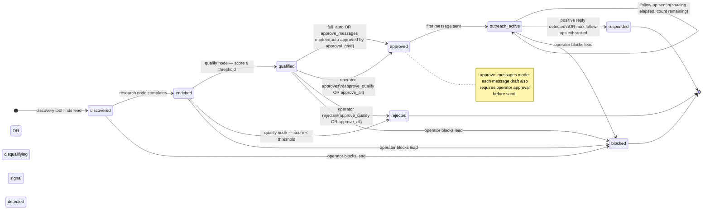

# Database Schema

Status: DRAFT

Canonical reference for every table, column, type, constraint, and index in the Zer0 Postgres database. The domain models in `spec/product/02-architecture.md` describe the Pydantic layer; this file describes the persistence layer.

---

## General rules

- All primary keys are `UUID` (generated by the application, not the database).
- `tenant_id UUID NOT NULL` is present on every table except `tenants` itself. It is indexed on every table. No query ever runs without a tenant filter — see `spec/engineering/tenant-isolation.md`.
- Timestamps are `TIMESTAMPTZ`, stored in UTC.
- All tables carry `created_at`, `updated_at`. Tables with user-deletable rows carry `deleted_at` (soft delete — `NULL` means active).
- JSONB columns store embedded config models. The application validates them via Pydantic before write and after read.
- Sensitive credential fields (OAuth tokens, API keys, webhook URLs) are **application-encrypted** before storage and **never** returned raw in API responses (see `spec/engineering/secret-hygiene.md`). Column names for such fields are suffixed `_enc`.
- All migrations live in `alembic/versions/`. Each migration is auto-generated from model changes. No hand-written DDL outside `alembic/`.

---

## Enum types

Postgres native enum types used across tables.

| Enum name        | Values                                                                               |
| ---------------- | ------------------------------------------------------------------------------------ |
| `lead_stage`     | `discovered`, `enriched`, `qualified`, `rejected`, `approved`, `outreach_active`, `responded`, `blocked` |
| `approval_mode`  | `full_auto`, `approve_qualify`, `approve_messages`, `approve_all`                    |
| `campaign_status`| `active`, `paused`, `archived`                                                       |
| `channel`        | `email`, `whatsapp`                                                                  |
| `message_status` | `drafted`, `pending_approval`, `approved`, `rejected`, `sent`                        |
| `sentiment`      | `positive`, `neutral`, `negative`                                                    |

---

## Entity-relationship diagram

```mermaid
erDiagram
    tenants {
        UUID        id                        PK
        TEXT        name
        TEXT        google_oauth_token_enc
        TEXT        whatsapp_api_key_enc
        TEXT        slack_webhook_url_enc
        JSONB       notification_rules
        INTEGER     retargeting_cooldown_days
        TEXT        default_approval_mode
        TIMESTAMPTZ created_at
        TIMESTAMPTZ updated_at
        TIMESTAMPTZ deleted_at
    }
    offerings {
        UUID        id                   PK
        UUID        tenant_id            FK
        TEXT        name
        TEXT        description
        TEXT        value_proposition
        TEXT_ARRAY  pain_points
        JSONB       discovery_config
        JSONB       icp
        JSONB       qualification_config
        JSONB       outreach_config
        TIMESTAMPTZ created_at
        TIMESTAMPTZ updated_at
        TIMESTAMPTZ deleted_at
    }
    campaigns {
        UUID        id                      PK
        UUID        tenant_id               FK
        UUID        offering_id             FK
        TEXT        name
        JSONB       discovery_override
        JSONB       icp_override
        JSONB       qualification_override
        JSONB       outreach_override
        TEXT        schedule
        INTEGER     volume_cap
        TEXT        approval_mode
        TEXT        status
        TIMESTAMPTZ created_at
        TIMESTAMPTZ updated_at
        TIMESTAMPTZ deleted_at
    }
    leads {
        UUID        id                   PK
        UUID        tenant_id            FK
        UUID        campaign_id          FK
        TEXT        stage
        TEXT        name
        TEXT        company
        TEXT        url
        TEXT        source
        JSONB       enriched_data
        NUMERIC     score
        JSONB       per_criterion_scores
        TEXT        rationale
        TEXT        rejection_reason
        TEXT        detected_language
        TIMESTAMPTZ blocked_at
        TIMESTAMPTZ discovered_at
        TIMESTAMPTZ created_at
        TIMESTAMPTZ updated_at
    }
    messages {
        UUID        id                    PK
        UUID        tenant_id             FK
        UUID        campaign_id           FK
        UUID        lead_id               FK
        TEXT        channel
        TEXT        subject
        TEXT        body
        TEXT        personalisation_notes
        JSONB       config_snapshot
        INTEGER     sequence_number
        TEXT        status
        TIMESTAMPTZ sent_at
        TEXT        external_message_id
        TIMESTAMPTZ created_at
        TIMESTAMPTZ updated_at
    }
    replies {
        UUID        id           PK
        UUID        tenant_id    FK
        UUID        lead_id      FK
        UUID        message_id   FK
        TEXT        channel
        TEXT        content
        TEXT        sentiment
        TIMESTAMPTZ received_at
        TIMESTAMPTZ created_at
    }
    events {
        UUID        id              PK
        UUID        tenant_id       FK
        UUID        campaign_id     FK
        UUID        lead_id         FK
        TEXT        event_type
        JSONB       payload
        JSONB       config_snapshot
        TIMESTAMPTZ created_at
    }

    tenants   ||--o{ offerings  : "has"
    tenants   ||--o{ campaigns  : "owns"
    tenants   ||--o{ leads      : "scopes"
    tenants   ||--o{ messages   : "scopes"
    tenants   ||--o{ replies    : "scopes"
    tenants   ||--o{ events     : "scopes"
    offerings ||--o{ campaigns  : "has"
    campaigns ||--o{ leads      : "discovers"
    campaigns ||--o{ messages   : "sends"
    leads     ||--o{ messages   : "receives"
    leads     ||--o{ replies    : "generates"
    leads     ||--o{ events     : "logged in"
    messages  ||--o{ replies    : "threads"
```

**Key cardinality notes:**
- `tenant_id` is the first filter in every query; it appears on every table.
- A `lead` belongs to exactly one `campaign`; if the same prospect is targeted in two campaigns, they have two separate `lead` rows.
- `events` is append-only (no UPDATE, no DELETE, no soft-delete). Rows accumulate forever.
- `replies.message_id` is nullable — if a reply cannot be correlated to a specific outbound message (e.g. a cold inbound), it still gets recorded.

---

## Lead lifecycle state machine

---

## Tables

### `tenants`

One row per tenant.

| Column                    | Type          | Constraints              | Notes                                         |
| ------------------------- | ------------- | ------------------------ | --------------------------------------------- |
| `id`                      | UUID          | PK, NOT NULL             |                                               |
| `name`                    | TEXT          | NOT NULL                 |                                               |
| `google_oauth_token_enc`  | TEXT          |                          | App-encrypted Google Workspace OAuth token.   |
| `whatsapp_api_key_enc`    | TEXT          |                          | App-encrypted WhatsApp Business API key.      |
| `slack_webhook_url_enc`   | TEXT          |                          | App-encrypted Slack webhook URL.              |
| `notification_rules`      | JSONB         |                          | `{event_type: channel}` map.                  |
| `retargeting_cooldown_days` | INTEGER     | DEFAULT 30               | Days before rejected lead can be re-qualified.|
| `default_approval_mode`   | approval_mode | NOT NULL, DEFAULT `full_auto` |                                          |
| `created_at`              | TIMESTAMPTZ   | NOT NULL, DEFAULT now()  |                                               |
| `updated_at`              | TIMESTAMPTZ   | NOT NULL, DEFAULT now()  |                                               |
| `deleted_at`              | TIMESTAMPTZ   |                          | NULL = active.                                |

**Indexes:** PK on `id`.

---

### `offerings`

One or many per tenant. Stores the full `DiscoveryConfig`, `ICP`, `QualificationConfig`, and `OutreachConfig` as JSONB.

| Column                  | Type          | Constraints              | Notes                                          |
| ----------------------- | ------------- | ------------------------ | ---------------------------------------------- |
| `id`                    | UUID          | PK, NOT NULL             |                                                |
| `tenant_id`             | UUID          | NOT NULL, FK → tenants.id |                                               |
| `name`                  | TEXT          | NOT NULL                 |                                                |
| `description`           | TEXT          |                          |                                                |
| `value_proposition`     | TEXT          |                          |                                                |
| `pain_points`           | TEXT[]        |                          |                                                |
| `discovery_config`      | JSONB         | NOT NULL                 | Serialised `DiscoveryConfig`.                  |
| `icp`                   | JSONB         | NOT NULL                 | Serialised `ICP`.                              |
| `qualification_config`  | JSONB         | NOT NULL                 | Serialised `QualificationConfig`.              |
| `outreach_config`       | JSONB         | NOT NULL                 | Serialised `OutreachConfig`.                   |
| `created_at`            | TIMESTAMPTZ   | NOT NULL, DEFAULT now()  |                                                |
| `updated_at`            | TIMESTAMPTZ   | NOT NULL, DEFAULT now()  |                                                |
| `deleted_at`            | TIMESTAMPTZ   |                          | NULL = active.                                 |

**Indexes:**
- PK on `id`.
- `idx_offerings_tenant` on `(tenant_id)`.

---

### `campaigns`

One or many per offering. Stores per-field overrides as JSONB (NULL = use offering default).

| Column                    | Type            | Constraints                | Notes                                              |
| ------------------------- | --------------- | -------------------------- | -------------------------------------------------- |
| `id`                      | UUID            | PK, NOT NULL               |                                                    |
| `tenant_id`               | UUID            | NOT NULL, FK → tenants.id  |                                                    |
| `offering_id`             | UUID            | NOT NULL, FK → offerings.id |                                                   |
| `name`                    | TEXT            | NOT NULL                   |                                                    |
| `discovery_override`      | JSONB           |                            | Partial `DiscoveryConfig`. NULL = no override.     |
| `icp_override`            | JSONB           |                            | Partial `ICP`. NULL = no override.                 |
| `qualification_override`  | JSONB           |                            | Partial `QualificationConfig`. NULL = no override. |
| `outreach_override`       | JSONB           |                            | Partial `OutreachConfig`. NULL = no override.      |
| `schedule`                | TEXT            |                            | Cron expression. NULL = manual trigger only.       |
| `volume_cap`              | INTEGER         |                            | Max leads per run. NULL = unlimited.               |
| `approval_mode`           | approval_mode   |                            | NULL = inherit from tenant default.                |
| `status`                  | campaign_status | NOT NULL, DEFAULT `active` |                                                    |
| `created_at`              | TIMESTAMPTZ     | NOT NULL, DEFAULT now()    |                                                    |
| `updated_at`              | TIMESTAMPTZ     | NOT NULL, DEFAULT now()    |                                                    |
| `deleted_at`              | TIMESTAMPTZ     |                            | NULL = active.                                     |

**Indexes:**
- PK on `id`.
- `idx_campaigns_tenant` on `(tenant_id)`.
- `idx_campaigns_offering` on `(tenant_id, offering_id)`.
- `idx_campaigns_status` on `(tenant_id, status)` WHERE `deleted_at IS NULL`.

---

### `leads`

All pipeline stages stored in one table. Stage progression is tracked via `stage`. One row per unique lead per campaign (leads re-discovered in a second run use the same row; `discovered_at` records first discovery, `updated_at` records last stage change).

| Column                   | Type          | Constraints                  | Notes                                                    |
| ------------------------ | ------------- | ---------------------------- | -------------------------------------------------------- |
| `id`                     | UUID          | PK, NOT NULL                 |                                                          |
| `tenant_id`              | UUID          | NOT NULL, FK → tenants.id    |                                                          |
| `campaign_id`            | UUID          | NOT NULL, FK → campaigns.id  |                                                          |
| `stage`                  | lead_stage    | NOT NULL, DEFAULT `discovered` |                                                        |
| `name`                   | TEXT          |                              |                                                          |
| `company`                | TEXT          |                              |                                                          |
| `url`                    | TEXT          |                              |                                                          |
| `source`                 | TEXT          |                              | `linkedin`, `web`, `directory`.                          |
| `enriched_data`          | JSONB         |                              | Serialised enrichment fields from `EnrichedLead`.        |
| `score`                  | NUMERIC(5,2)  |                              | 0–100. NULL until qualified.                             |
| `per_criterion_scores`   | JSONB         |                              | `{criterion_name: score}`. NULL until qualified.         |
| `rationale`              | TEXT          |                              | LLM reasoning for score.                                 |
| `rejection_reason`       | TEXT          |                              | NULL unless stage = `rejected`.                          |
| `detected_language`      | TEXT          |                              | ISO 639-1 code.                                          |
| `blocked_at`             | TIMESTAMPTZ   |                              | Non-null = permanently blocked.                          |
| `discovered_at`          | TIMESTAMPTZ   | NOT NULL, DEFAULT now()      |                                                          |
| `created_at`             | TIMESTAMPTZ   | NOT NULL, DEFAULT now()      |                                                          |
| `updated_at`             | TIMESTAMPTZ   | NOT NULL, DEFAULT now()      |                                                          |

No `deleted_at` — leads are permanently blocked via `blocked_at`, not soft-deleted (audit trail must be preserved).

**Indexes:**
- PK on `id`.
- `idx_leads_tenant` on `(tenant_id)`.
- `idx_leads_campaign_stage` on `(tenant_id, campaign_id, stage)` WHERE `blocked_at IS NULL`.
- `idx_leads_url` on `(tenant_id, campaign_id, url)` — deduplication guard on re-discovery.

---

### `messages`

All drafted and sent messages, across all channels and sequence positions.

| Column                    | Type           | Constraints                  | Notes                                                      |
| ------------------------- | -------------- | ---------------------------- | ---------------------------------------------------------- |
| `id`                      | UUID           | PK, NOT NULL                 |                                                            |
| `tenant_id`               | UUID           | NOT NULL, FK → tenants.id    |                                                            |
| `campaign_id`             | UUID           | NOT NULL, FK → campaigns.id  |                                                            |
| `lead_id`                 | UUID           | NOT NULL, FK → leads.id      |                                                            |
| `channel`                 | channel        | NOT NULL                     |                                                            |
| `subject`                 | TEXT           |                              | Email only. NULL for WhatsApp.                             |
| `body`                    | TEXT           | NOT NULL                     |                                                            |
| `personalisation_notes`   | TEXT           |                              | LLM reasoning notes used during drafting.                  |
| `config_snapshot`         | JSONB          | NOT NULL                     | Full `ResolvedConfig` at time of draft. Immutable.         |
| `sequence_number`         | INTEGER        | NOT NULL, DEFAULT 1          | 1 = first touch, 2+ = follow-ups.                         |
| `status`                  | message_status | NOT NULL, DEFAULT `drafted`  |                                                            |
| `sent_at`                 | TIMESTAMPTZ    |                              | NULL until sent.                                           |
| `external_message_id`     | TEXT           |                              | Provider message ID (Gmail thread ID, WhatsApp message ID).|
| `created_at`              | TIMESTAMPTZ    | NOT NULL, DEFAULT now()      |                                                            |
| `updated_at`              | TIMESTAMPTZ    | NOT NULL, DEFAULT now()      |                                                            |

**Indexes:**
- PK on `id`.
- `idx_messages_tenant` on `(tenant_id)`.
- `idx_messages_lead` on `(tenant_id, lead_id)`.
- `idx_messages_pending` on `(tenant_id, status)` WHERE `status = 'pending_approval'`.

---

### `replies`

All inbound replies, across all channels. One row per received reply.

| Column          | Type          | Constraints                  | Notes                                                   |
| --------------- | ------------- | ---------------------------- | ------------------------------------------------------- |
| `id`            | UUID          | PK, NOT NULL                 |                                                         |
| `tenant_id`     | UUID          | NOT NULL, FK → tenants.id    |                                                         |
| `lead_id`       | UUID          | NOT NULL, FK → leads.id      |                                                         |
| `message_id`    | UUID          |                              | FK → messages.id. NULL if reply cannot be threaded.     |
| `channel`       | channel       | NOT NULL                     |                                                         |
| `content`       | TEXT          | NOT NULL                     |                                                         |
| `sentiment`     | sentiment     |                              | NULL until classified.                                  |
| `received_at`   | TIMESTAMPTZ   | NOT NULL                     |                                                         |
| `created_at`    | TIMESTAMPTZ   | NOT NULL, DEFAULT now()      |                                                         |

**Indexes:**
- PK on `id`.
- `idx_replies_lead` on `(tenant_id, lead_id)`.

---

### `events`

Append-only audit log. One row per agent action. Never updated, never deleted.

| Column            | Type          | Constraints                  | Notes                                                       |
| ----------------- | ------------- | ---------------------------- | ----------------------------------------------------------- |
| `id`              | UUID          | PK, NOT NULL                 |                                                             |
| `tenant_id`       | UUID          | NOT NULL, FK → tenants.id    |                                                             |
| `campaign_id`     | UUID          |                              | FK → campaigns.id. NULL for tenant-level events.            |
| `lead_id`         | UUID          |                              | FK → leads.id. NULL for campaign-level events.              |
| `event_type`      | TEXT          | NOT NULL                     | See event type list in `02-architecture.md`.                |
| `payload`         | JSONB         | NOT NULL                     | Event-specific data (input/output of the action).           |
| `config_snapshot` | JSONB         |                              | `ResolvedConfig` active at time of event. NULL for non-agent events. |
| `created_at`      | TIMESTAMPTZ   | NOT NULL, DEFAULT now()      |                                                             |

**Indexes:**
- PK on `id`.
- `idx_events_tenant_time` on `(tenant_id, created_at DESC)`.
- `idx_events_campaign` on `(tenant_id, campaign_id, created_at DESC)`.
- `idx_events_lead` on `(tenant_id, lead_id, created_at DESC)`.

---

## Migration strategy

- Tool: `alembic>=1.13` with `async` support disabled (sync psycopg driver used in migrations).
- All migrations in `alembic/versions/`. File names: `{revision}_{slug}.py`.
- `alembic upgrade head` is idempotent — safe to run on every deployment.
- No raw `ALTER TABLE` outside alembic. No hand-written DDL.
- Down migrations (`downgrade`) are implemented but not used in production automation — rollback is always a forward migration.
