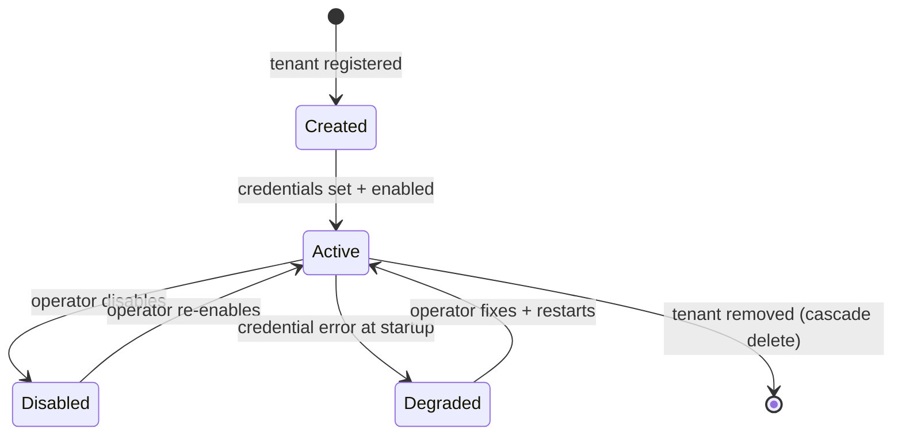

# Tenancy

**Status:** DRAFT

A **tenant** is the unit of multi-tenancy in Zer0. One tenant represents one
customer/brand and owns a set of sales campaigns, each targeting a specific
offering. Every DB row (except operator-level rows) is scoped to a `tenant_id`.

---

## What a tenant is

| Attribute | Type | Notes |
|---|---|---|
| `id` | UUID string | Immutable once created |
| credentials | `TenantRow` columns | Fernet-encrypted at rest in DB |
| campaigns | `CampaignRow` rows | Scoped by `tenant_id` |
| offerings | `OfferingRow` rows | Scoped by `tenant_id` |

A tenant can be `enabled: true` or `enabled: false`. Disabled tenants are skipped by the scheduler.

---

## Tenant lifecycle

### Create
- Insert into `tenants` + provision empty credential columns.
- Starts `enabled = false`.

### Configure
- Operator fills credentials (Gmail OAuth, WhatsApp API key, Slack webhook) via the API or UI.
- Credentials are Fernet-encrypted before being written to the DB.

### Enable
- `tenants.enabled = true`. Next daemon restart picks up the tenant.

### Disable
- `tenants.enabled = false`. In-flight campaign runs complete; no new runs start.

### Remove
- Cascades: deletes `offerings`, `campaigns`, `leads`, `messages`, `replies`, `events`.

---

## Isolation guarantees

These are the contractual properties all code must maintain. Violating any one of them is a bug.

1. **Data isolation.** Every non-`tenants` table has a `tenant_id` column. No query reads rows across tenants.
2. **Error isolation.** An exception raised for tenant A never prevents tenant B's scheduled jobs from running.
3. **Credential isolation.** Tenant A's credentials are never used for tenant B's API calls.
4. **Secret isolation.** Credential bytes for tenant A are never decrypted in the context of tenant B. Every Fernet decrypt is parameterized by `tenant_id`.

See [`../engineering/tenant-isolation.md`](../engineering/tenant-isolation.md) for the patterns that maintain these guarantees.

---

## Secrets

### Where secrets live

- **Tenant credentials** (Gmail OAuth JSON, WhatsApp API key, Slack webhook URL) stored as Fernet-encrypted columns in the `tenants` table.
- **Bootstrap secrets** (`ZER0_DATABASE_URL`, `ZER0_CREDENTIAL_ENCRYPTION_KEY`, `ZER0_ANTHROPIC_API_KEY`) in environment variables / `config/.env`.
- **Never** in source code, git history, logs, or commit messages.

### Which values are secrets

| Column | Plaintext value |
|---|---|
| `google_oauth_token_enc` | Gmail OAuth token JSON |
| `whatsapp_api_key_enc` | Meta Cloud API key |
| `slack_webhook_url` | Slack incoming webhook URL |

### Resolution

`ConfigResolver.resolve(campaign_id, tenant_id)` decrypts only the tenant row matching `tenant_id`. The decrypted value lives in memory only for the duration of the campaign run.

---

## Failure isolation in practice

Daemon startup:

1. Load all tenants with `enabled = true`.
2. For each tenant, attempt to build credentials. On failure:
   - Log structured error `tenant_startup_failed` with `tenant_id` and reason.
   - Mark tenant as degraded for this process lifetime.
   - Continue loading remaining tenants.
3. Degraded tenants skip their scheduled jobs but remain visible via `GET /api/v1/tenants`.

---

## Naming

- Tenant IDs are UUIDs generated at creation. Immutable.
- Tenant names are free-form UTF-8 for display only.
