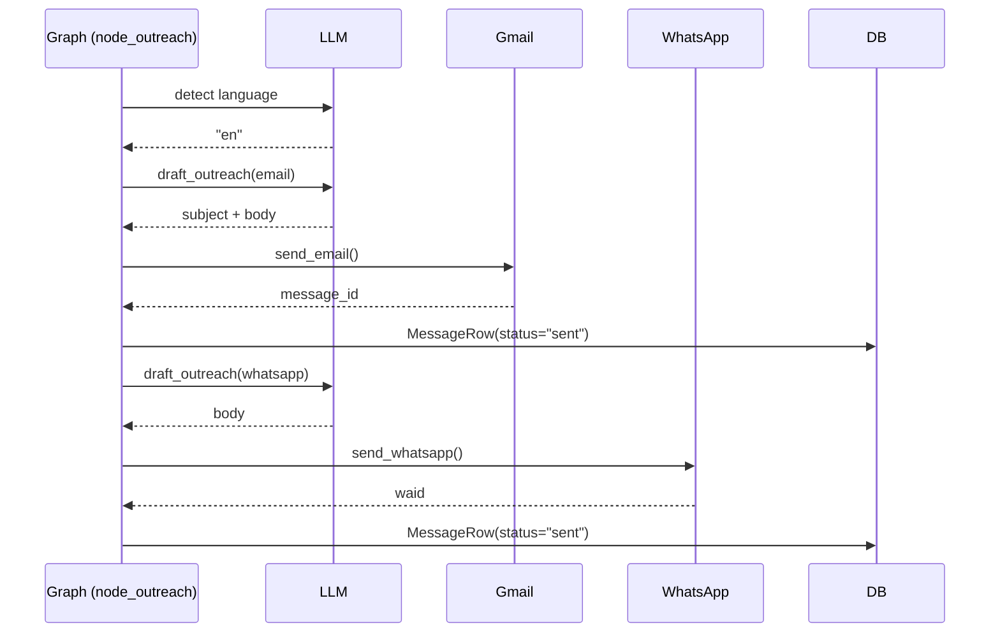

# Capability: Outreach

**Status:** DRAFT

## Purpose

Draft personalised first-touch messages for each qualified lead and send them via the configured channels (email and/or WhatsApp).

## Trigger

`node_outreach` runs after `node_approval_gate` (if approval mode is off, the gate is a pass-through).

## Behavior

1. For each `QualifiedLead` in `AgentState.qualified_leads`:
   a. Detect message language via `detect_language` (LLM, falls back to `"en"`).
   b. For each enabled channel (`email`, `whatsapp`) in `ResolvedConfig.outreach_config`:
      - Render `outreach.md` prompt with lead data and channel-specific constraints.
      - Call `draft_outreach` (LLM) to produce subject + body.
      - Send via `send_email` or `send_whatsapp`.
      - Write `MessageRow` with `status = "sent"`.
      - Emit `message_sent` event.
2. If approval mode is enabled, outreach drafts go to `stage = "pending_approval"` first and the graph parks until approved via the API.

## Inputs

| Key | Source |
|---|---|
| `qualified_leads` | `AgentState.qualified_leads` |
| `channels` | `ResolvedConfig.outreach_config.channels` |
| `google_oauth_token_enc` | `ResolvedConfig` (decrypted) |
| `whatsapp_api_key_enc` | `ResolvedConfig` (decrypted) |
| `outreach.md` prompt | `src/zer0/prompts/outreach.md` |

## Outputs

| Output | Type |
|---|---|
| `AgentState.sent_messages` | `list[SentMessage]` |
| `messages` DB rows | `status = "sent"` or `"failed"` |
| `events` DB rows | `message_sent` or `message_send_failed` |

## Failure modes

| Class | Response |
|---|---|
| Gmail API error | Log `email_send_failed`, write `MessageRow(status="failed")`, continue to next lead |
| WhatsApp API 4xx | Log `whatsapp_send_failed`, write `MessageRow(status="failed")`, continue |
| Approval mode — no approval within TTL | Park state; operator must approve or reject via API |
| LLM draft parse error | Log `draft_parse_error`, skip channel for this lead |

## Out of scope

- A/B testing of message variants.
- Unsubscribe handling in v1.
