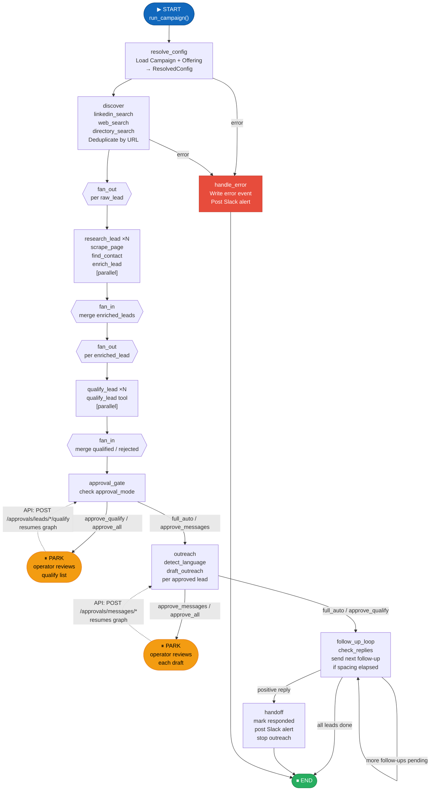
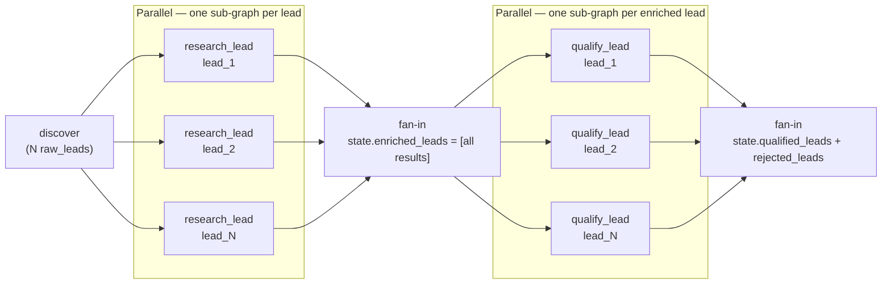
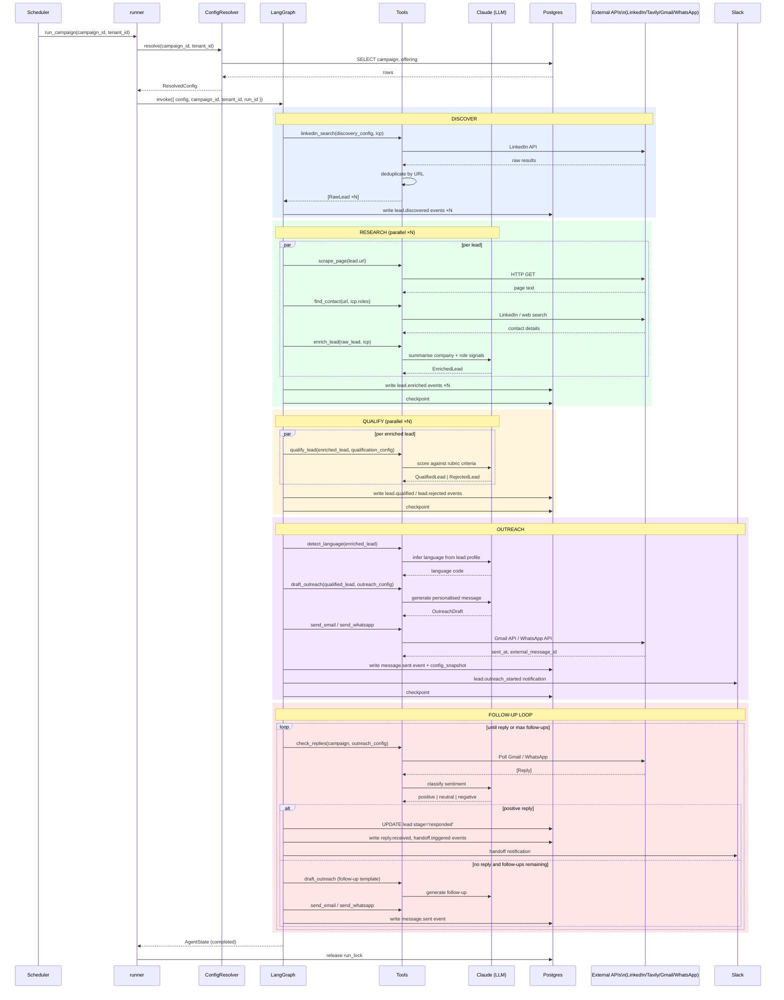

# Agent Graph

Status: DRAFT

LangGraph design for the Zer0 agent runtime. This file specifies the state schema, node contracts, edge conditions, and error handling strategy. The architecture overview in `spec/product/02-architecture.md` describes the control flow at a high level; this file specifies the implementation contract.

---

## Overview

The agent is a LangGraph `StateGraph`. One compiled graph is instantiated at application startup and reused. Each campaign run is a separate invocation — the graph is invoked with a fresh `AgentState` populated with the `ResolvedConfig` for that run.

---

## State schema

`AgentState` is a `TypedDict` (as required by LangGraph). All fields have defaults so the initial state is valid with only `run_id`, `campaign_id`, and `tenant_id` populated.

```python
class AgentState(TypedDict):
    # --- Identity ---
    run_id: str                          # UUID for this campaign run.
    tenant_id: str                       # Tenant scope.
    campaign_id: str                     # Campaign being run.
    config: ResolvedConfig               # Computed once at run start. Immutable.

    # --- Discovery ---
    raw_leads: list[RawLead]             # Accumulated across all discovery sources.

    # --- Per-lead pipeline (keyed by lead.id) ---
    enriched_leads: list[EnrichedLead]
    qualified_leads: list[QualifiedLead]
    rejected_leads: list[RejectedLead]

    # --- Approval gate ---
    pending_approval_lead_ids: list[str] # Leads waiting for human qualify approval.
    approved_lead_ids: list[str]         # Approved after human review.

    # --- Outreach ---
    outreach_drafts: list[OutreachDraft]
    sent_messages: list[SentMessage]
    replies: list[Reply]

    # --- Run control ---
    error: str | None                    # Non-null if the run should abort.
    completed_lead_ids: list[str]        # Leads fully finished (responded or max follow-ups reached).
```

All mutations to `AgentState` happen inside node functions. No node reads from the database mid-run — all data flows through state. State is checkpointed to Postgres via LangGraph's checkpointer after each node completes.

---

## Nodes

Each node is a plain Python function with signature:

```python
def node_name(state: AgentState) -> dict:
    ...
    return {"field": new_value, ...}
```

The returned dict is merged into state. Nodes must not mutate the state dict in-place.

### `resolve_config`

- Reads `campaign_id` from state.
- Calls `ConfigResolver.resolve(campaign_id, tenant_id)` → `ResolvedConfig`.
- Returns `{"config": resolved_config}`.
- Aborts run with `{"error": "..."}` if campaign not found or config is invalid.

### `discover`

- Reads `config.discovery_config` and `config.icp`.
- Calls discovery tools in sequence: `linkedin_search`, `web_search`, `directory_search` — filtered to sources listed in `config.discovery_config.sources`.
- Deduplicates results by URL (against existing `leads` rows for this campaign).
- Trims to `min(len(results), config.discovery_config.volume_per_run)`.
- Writes `lead.discovered` events for each new lead.
- Returns `{"raw_leads": [...]}`

### `research`

- Iterates `state.raw_leads`.
- For each lead: calls `scrape_page(lead.url)`, `find_contact(lead.url, config.icp.target_roles)`, then `enrich_lead(raw_lead, config.icp)`.
- Writes `lead.enriched` event per lead.
- Returns `{"enriched_leads": [...]}`.

### `qualify`

- Iterates `state.enriched_leads`.
- For each lead: calls `qualify_lead(enriched_lead, config.qualification_config)`.
- Separates results into qualified vs rejected.
- Writes `lead.qualified` or `lead.rejected` event per lead.
- Returns `{"qualified_leads": [...], "rejected_leads": [...]}`.

### `approval_gate`

- Checks `config.approval_mode`.
- If `full_auto` or `approve_messages`: passes all qualified leads directly → `approved_lead_ids = [l.id for l in qualified_leads]`.
- If `approve_qualify` or `approve_all`:
  - For each qualified lead, creates a `messages` row with `status = pending_approval` (qualify type).
  - Posts `approval.pending` event and Slack notification.
  - Returns `{"pending_approval_lead_ids": [...]}`.
  - The graph then **parks** (returns to the caller). A subsequent API call to `POST /approvals/leads/{id}/qualify` resumes the graph by updating state and re-invoking.

### `outreach`

- Iterates `state.approved_lead_ids`.
- For each lead: calls `detect_language(enriched_lead)`, then `draft_outreach(qualified_lead, config.outreach_config)`.
- If `approval_mode` is `approve_messages` or `approve_all`:
  - Creates `messages` row with `status = pending_approval`.
  - Posts `approval.pending` event and Slack notification.
  - Parks until `POST /approvals/messages/{id}` resumes.
- Otherwise: calls `send_email` or `send_whatsapp` based on `config.outreach_config.channels_enabled`.
- Writes `message.drafted`, (optionally) `message.sent` events.
- Returns `{"outreach_drafts": [...], "sent_messages": [...]}`.

### `follow_up_loop`

- Runs after `outreach`. Checks for replies via `check_replies`.
- For leads with a positive reply: writes `reply.received`, `handoff.triggered` events; posts Slack alert; moves lead to `responded` stage; adds to `completed_lead_ids`.
- For leads with no reply and remaining follow-ups: checks `follow_up_spacing_days` against the last `sent_at` timestamp; sends the next follow-up if due.
- Loops (via edge back to itself) until all active outreach leads are either responded or exhausted.
- Returns `{"replies": [...], "sent_messages": [...], "completed_lead_ids": [...]}`.

### `handle_error`

- Called when `state.error` is non-null.
- Writes an `error` event to the audit log.
- Posts a Slack alert to the tenant's error channel (if configured).
- Terminates the run cleanly.

---

## Edges

```
START
  └─► resolve_config
         └─► discover
                └─► research          (parallel fan-out per lead, then fan-in — see below)
                       └─► qualify
                              └─► approval_gate
                                     ├─► [if full_auto / approve_messages] outreach
                                     └─► [if approve_qualify / approve_all] PARK → resume → outreach
                                              └─► follow_up_loop ─┐
                                                                   └─► (loop back if pending follow-ups)
                                                                          └─► END
```

Conditional edge from `approval_gate`:
```python
def route_after_approval_gate(state: AgentState) -> str:
    if state["pending_approval_lead_ids"]:
        return END   # graph parks; re-invoked by approval API
    return "outreach"
```

Conditional edge from `follow_up_loop`:
```python
def route_follow_up(state: AgentState) -> str:
    active = [
        m for m in state["sent_messages"]
        if m.lead_id not in state["completed_lead_ids"]
    ]
    if active:
        return "follow_up_loop"
    return END
```

Error edge: every node checks `state["error"]` at entry and immediately routes to `handle_error` if non-null:
```python
def route_on_error(state: AgentState) -> str:
    if state.get("error"):
        return "handle_error"
    return "next_node"
```

---

## Graph topology diagram

Full LangGraph topology. Dashed edges are conditional. `[P]` marks nodes that can park (return to `END`) and be resumed externally.



---

## Fan-out / fan-in: per-lead parallelism

Research and qualify run in parallel across leads using LangGraph's `Send` API.



Each `research_lead` / `qualify_lead` sub-graph is an independent LangGraph `Send` invocation. They share no mutable state — each returns a partial dict that LangGraph merges via list-append reducers declared on `AgentState`.

---

## End-to-end sequence: happy path (full_auto mode)



---

## Parallelism

The `research` and `qualify` nodes process leads independently. LangGraph's `Send` API is used to fan out per-lead work and fan back in:

```python
# After discover node:
def fan_out_research(state: AgentState) -> list[Send]:
    return [Send("research_lead", {"lead": lead, "config": state["config"]}) for lead in state["raw_leads"]]
```

Each `research_lead` invocation processes one lead and returns `{"enriched_lead": EnrichedLead}`. The graph collector merges all results back into `state["enriched_leads"]`.

Same pattern is applied to `qualify_lead` per enriched lead.

---

## Checkpointing

LangGraph's `PostgresSaver` is used as the checkpointer. Connection string sourced from `config.database_url` (never hardcoded).

Checkpoint key: `(tenant_id, campaign_id, run_id)`. This allows:
- Resumption after `approval_gate` parks.
- Recovery if the process crashes mid-run.
- Full replay of any historical run for debugging.

---

## Observability contract

Every node calls `observability.write_event(event_type, payload, config_snapshot, tenant_id, campaign_id, lead_id)` before returning. No node returns without writing at least one event.

Slack notifications are posted inside `observability.post_slack_event` — never directly in node code.

---

## Graph file layout

| File                      | Responsibility                                                 |
| ------------------------- | -------------------------------------------------------------- |
| `src/graph/state.py`      | `AgentState` TypedDict definition.                             |
| `src/graph/nodes.py`      | All node functions.                                            |
| `src/graph/edges.py`      | All conditional edge functions.                                |
| `src/graph/agent.py`      | Graph assembly: `StateGraph`, node registration, edge wiring, `compile()`. Must stay ≤ 50 lines. |
| `src/graph/runner.py`     | `run_campaign(campaign_id, tenant_id)` — the public entry point called by the scheduler and the `/campaigns/{id}/trigger` endpoint. |

---

## Implementation rules

1. `agent.py` stays ≤ 50 lines. Behaviour lives in `nodes.py` and `edges.py`.
2. Nodes are pure-ish: no I/O except via tools and `observability`. No direct DB access in nodes.
3. All tools used by nodes are imported from `src/tools/`. One file per tool.
4. `ResolvedConfig` is set once in `resolve_config` and never modified after that.
5. State fields are lists not dicts — LangGraph merges via the reducer declared in `AgentState`.
6. The graph is compiled once at startup. Recompilation is not allowed at runtime.
