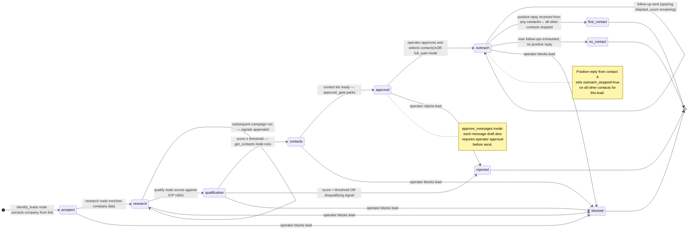

# Database Schema

Status: DRAFT

Canonical reference for every table, column, type, constraint, and index in the Zer0 Postgres database. The domain models in `spec/product/02-architecture.md` describe the Pydantic layer; this file describes the persistence layer.

---

## General rules

- All primary keys are `UUID` (generated by the application, not the database).
- `tenant_id UUID NOT NULL` is present on every table except `tenants` itself. It is indexed on every table. No query ever runs without a tenant filter — see `spec/engineering/tenant-isolation.md`.
- Timestamps are `TIMESTAMPTZ`, stored in UTC.
- All tables carry `created_at`, `updated_at`. Tables with user-deletable rows carry `deleted_at` (soft delete — `NULL` means active).
- JSONB columns store embedded config models. The application validates them via Pydantic before write and after read.
- Sensitive credential fields (OAuth tokens, API keys, webhook URLs) are **application-encrypted** before storage and **never** returned raw in API responses (see `spec/engineering/secret-hygiene.md`). Column names for such fields are suffixed `_enc`.
- All migrations live in `alembic/versions/`. Each migration is auto-generated from model changes. No hand-written DDL outside `alembic/`.

---

## Enum types

Postgres native enum types used across tables.

| Enum name          | Values                                                                                                                          |
| ------------------ | ------------------------------------------------------------------------------------------------------------------------------- |
| `lead_stage`       | `prospect`, `research`, `qualification`, `contacts`, `approval`, `outreach`, `first_contact`, `no_contact`, `rejected`, `blocked` |
| `link_source`      | `web`, `linkedin`, `directory`                                                                                                  |
| `business_type`    | `enterprise`, `mid_market`, `smb`, `clinic`, `service_provider`, `solo`                                                        |
| `seniority_level`  | `c_level`, `vp`, `director`, `manager`, `ic`, `other`                                                                          |
| `approval_mode`    | `full_auto`, `approve_qualify`, `approve_messages`, `approve_all`                                                               |
| `campaign_status`  | `active`, `paused`, `archived`                                                                                                  |
| `channel`          | `email`, `whatsapp`                                                                                                             |
| `message_status`   | `drafted`, `pending_approval`, `approved`, `rejected`, `sent`, `stopped`                                                        |
| `sentiment`        | `positive`, `neutral`, `negative`                                                                                               |

---

## Entity-relationship diagram

```mermaid
erDiagram
    tenants {
        UUID        id                        PK
        TEXT        name
        TEXT        google_oauth_token_enc
        TEXT        whatsapp_api_key_enc
        TEXT        slack_webhook_url_enc
        JSONB       notification_rules
        INTEGER     retargeting_cooldown_days
        TEXT        default_approval_mode
        TIMESTAMPTZ created_at
        TIMESTAMPTZ updated_at
        TIMESTAMPTZ deleted_at
    }
    offerings {
        UUID        id                   PK
        UUID        tenant_id            FK
        TEXT        name
        TEXT        description
        TEXT        value_proposition
        TEXT_ARRAY  pain_points
        JSONB       discovery_config
        JSONB       icp
        JSONB       qualification_config
        JSONB       outreach_config
        TIMESTAMPTZ created_at
        TIMESTAMPTZ updated_at
        TIMESTAMPTZ deleted_at
    }
    campaigns {
        UUID        id                      PK
        UUID        tenant_id               FK
        UUID        offering_id             FK
        TEXT        name
        JSONB       discovery_override
        JSONB       icp_override
        JSONB       qualification_override
        JSONB       outreach_override
        TEXT        schedule
        INTEGER     volume_cap
        TEXT        approval_mode
        TEXT        status
        TIMESTAMPTZ created_at
        TIMESTAMPTZ updated_at
        TIMESTAMPTZ deleted_at
    }
    links {
        UUID        id              PK
        UUID        tenant_id       FK
        UUID        campaign_id     FK
        TEXT        url
        TEXT        source
        TEXT        page_text
        TIMESTAMPTZ scraped_at
        TIMESTAMPTZ identified_at
        TIMESTAMPTZ created_at
    }
    customers {
        UUID        id               PK
        UUID        tenant_id        FK
        TEXT        domain
        TEXT        company_name
        TEXT        industry
        TEXT        headcount_range
        TEXT        business_type
        TEXT        research_summary
        JSONB       signals
        TEXT        notes
        TIMESTAMPTZ first_seen_at
        TIMESTAMPTZ last_enriched_at
        TIMESTAMPTZ created_at
        TIMESTAMPTZ updated_at
    }
    leads {
        UUID        id                   PK
        UUID        tenant_id            FK
        UUID        campaign_id          FK
        UUID        link_id              FK
        UUID        customer_id          FK
        TEXT        stage
        TEXT        company_name
        TEXT        domain
        TEXT        industry
        TEXT        headcount_range
        TEXT        business_type
        TEXT        research_summary
        JSONB       signals
        NUMERIC     score
        JSONB       per_criterion_scores
        TEXT        rationale
        TEXT        rejection_reason
        TIMESTAMPTZ last_researched_at
        TIMESTAMPTZ blocked_at
        TIMESTAMPTZ created_at
        TIMESTAMPTZ updated_at
    }
    contacts {
        UUID        id                   PK
        UUID        tenant_id            FK
        UUID        lead_id              FK
        TEXT        first_name
        TEXT        last_name
        TEXT        email
        TEXT        phone
        TEXT        role
        TEXT        seniority_level
        NUMERIC     decision_maker_score
        BOOLEAN     approved_for_outreach
        BOOLEAN     outreach_stopped
        TIMESTAMPTZ created_at
        TIMESTAMPTZ updated_at
    }
    messages {
        UUID        id                    PK
        UUID        tenant_id             FK
        UUID        campaign_id           FK
        UUID        lead_id               FK
        UUID        contact_id            FK
        TEXT        channel
        TEXT        subject
        TEXT        body
        TEXT        personalisation_notes
        JSONB       config_snapshot
        INTEGER     sequence_number
        TEXT        status
        TIMESTAMPTZ sent_at
        TEXT        external_message_id
        TIMESTAMPTZ created_at
        TIMESTAMPTZ updated_at
    }
    replies {
        UUID        id           PK
        UUID        tenant_id    FK
        UUID        lead_id      FK
        UUID        contact_id   FK
        UUID        message_id   FK
        TEXT        channel
        TEXT        content
        TEXT        sentiment
        TIMESTAMPTZ received_at
        TIMESTAMPTZ created_at
    }
    events {
        UUID        id              PK
        UUID        tenant_id       FK
        UUID        campaign_id     FK
        UUID        lead_id         FK
        TEXT        event_type
        JSONB       payload
        JSONB       config_snapshot
        TIMESTAMPTZ created_at
    }

    tenants    ||--o{ offerings  : "has"
    tenants    ||--o{ campaigns  : "owns"
    tenants    ||--o{ links      : "scopes"
    tenants    ||--o{ customers  : "knows"
    tenants    ||--o{ leads      : "scopes"
    tenants    ||--o{ contacts   : "scopes"
    tenants    ||--o{ messages   : "scopes"
    tenants    ||--o{ replies    : "scopes"
    tenants    ||--o{ events     : "scopes"
    offerings  ||--o{ campaigns  : "has"
    campaigns  ||--o{ links      : "discovers"
    links      ||--o{ leads      : "surfaces"
    customers  ||--o{ leads      : "aggregates"
    leads      ||--o{ contacts   : "has"
    leads      ||--o{ messages   : "receives"
    leads      ||--o{ replies    : "generates"
    leads      ||--o{ events     : "logged_in"
    contacts   ||--o{ messages   : "targeted_by"
    contacts   ||--o{ replies    : "sends"
    messages   ||--o{ replies    : "threads"
```

**Key cardinality notes:**
- `tenant_id` is the first filter in every query; it appears on every table.
- A `link` belongs to exactly one campaign; one link page can surface multiple leads (one per identified company).
- A `lead` belongs to exactly one campaign; if the same company appears in two campaigns they have two `lead` rows.
- A `customer` belongs to one tenant and is keyed on `(tenant_id, domain)` — one row per company, tenant-wide. Multiple leads (across multiple campaigns) can reference the same customer. The customer record accumulates knowledge cumulatively: `research_summary` and `signals` are appended on every agent run; humans can patch `company_name`, `industry`, and `notes` directly.
- `links.identified_at` is `NULL` until `node_identify_leads` processes the link. A `NULL` value means the link has not yet been run through the identify step and is eligible for retry.
- `leads.customer_id` is nullable; set by `node_identify_leads` when a customer row is upserted for the lead's domain.
- A `contact` belongs to exactly one lead. If the same person appears in two campaigns they have two `contact` rows.
- `contact_id` on messages and replies is nullable — messages drafted before contact discovery omit it.
- `events` is append-only (no UPDATE, no DELETE, no soft-delete). Rows accumulate forever.

---

## Lead lifecycle state machine

---

## Tables

### `tenants`

One row per tenant.

| Column                      | Type          | Constraints                   | Notes                                          |
| --------------------------- | ------------- | ----------------------------- | ---------------------------------------------- |
| `id`                        | UUID          | PK, NOT NULL                  |                                                |
| `name`                      | TEXT          | NOT NULL                      |                                                |
| `google_oauth_token_enc`    | TEXT          |                               | App-encrypted Google Workspace OAuth token.    |
| `whatsapp_api_key_enc`      | TEXT          |                               | App-encrypted WhatsApp Business API key.       |
| `slack_webhook_url_enc`     | TEXT          |                               | App-encrypted Slack webhook URL.               |
| `notification_rules`        | JSONB         |                               | `{event_type: channel}` map.                   |
| `retargeting_cooldown_days` | INTEGER       | DEFAULT 30                    | Days before rejected lead can be re-targeted.  |
| `default_approval_mode`     | approval_mode | NOT NULL, DEFAULT `full_auto` |                                                |
| `created_at`                | TIMESTAMPTZ   | NOT NULL, DEFAULT now()       |                                                |
| `updated_at`                | TIMESTAMPTZ   | NOT NULL, DEFAULT now()       |                                                |
| `deleted_at`                | TIMESTAMPTZ   |                               | NULL = active.                                 |

**Indexes:** PK on `id`.

---

### `offerings`

One or many per tenant. Stores the full `DiscoveryConfig`, `ICP`, `QualificationConfig`, and `OutreachConfig` as JSONB.

| Column                 | Type        | Constraints               | Notes                           |
| ---------------------- | ----------- | ------------------------- | ------------------------------- |
| `id`                   | UUID        | PK, NOT NULL              |                                 |
| `tenant_id`            | UUID        | NOT NULL, FK → tenants.id |                                 |
| `name`                 | TEXT        | NOT NULL                  |                                 |
| `description`          | TEXT        |                           |                                 |
| `value_proposition`    | TEXT        |                           |                                 |
| `pain_points`          | TEXT[]      |                           |                                 |
| `discovery_config`     | JSONB       | NOT NULL                  | Serialised `DiscoveryConfig`.   |
| `icp`                  | JSONB       | NOT NULL                  | Serialised `ICP`.               |
| `qualification_config` | JSONB       | NOT NULL                  | Serialised `QualificationConfig`. |
| `outreach_config`      | JSONB       | NOT NULL                  | Serialised `OutreachConfig`.    |
| `created_at`           | TIMESTAMPTZ | NOT NULL, DEFAULT now()   |                                 |
| `updated_at`           | TIMESTAMPTZ | NOT NULL, DEFAULT now()   |                                 |
| `deleted_at`           | TIMESTAMPTZ |                           | NULL = active.                  |

**Indexes:** PK on `id`; `idx_offerings_tenant` on `(tenant_id)`.

---

### `campaigns`

One or many per offering. Per-field overrides as JSONB (NULL = use offering default).

| Column                   | Type            | Constraints                  | Notes                                              |
| ------------------------ | --------------- | ---------------------------- | -------------------------------------------------- |
| `id`                     | UUID            | PK, NOT NULL                 |                                                    |
| `tenant_id`              | UUID            | NOT NULL, FK → tenants.id    |                                                    |
| `offering_id`            | UUID            | NOT NULL, FK → offerings.id  |                                                    |
| `name`                   | TEXT            | NOT NULL                     |                                                    |
| `discovery_override`     | JSONB           |                              | Partial `DiscoveryConfig`. NULL = no override.     |
| `icp_override`           | JSONB           |                              | Partial `ICP`. NULL = no override.                 |
| `qualification_override` | JSONB           |                              | Partial `QualificationConfig`. NULL = no override. |
| `outreach_override`      | JSONB           |                              | Partial `OutreachConfig`. NULL = no override.      |
| `schedule`               | TEXT            |                              | Cron expression. NULL = manual trigger only.       |
| `volume_cap`             | INTEGER         |                              | Max leads per run. NULL = unlimited.               |
| `approval_mode`          | approval_mode   |                              | NULL = inherit from tenant default.                |
| `status`                 | campaign_status | NOT NULL, DEFAULT `active`   |                                                    |
| `created_at`             | TIMESTAMPTZ     | NOT NULL, DEFAULT now()      |                                                    |
| `updated_at`             | TIMESTAMPTZ     | NOT NULL, DEFAULT now()      |                                                    |
| `deleted_at`             | TIMESTAMPTZ     |                              | NULL = active.                                     |

**Indexes:** PK on `id`; `idx_campaigns_tenant` on `(tenant_id)`; `idx_campaigns_offering` on `(tenant_id, offering_id)`; `idx_campaigns_status` on `(tenant_id, status)` WHERE `deleted_at IS NULL`.

---

### `links`

Raw discovery results — one row per URL found during a campaign run. A single page can surface multiple leads (one per identified company). Page text is stored for downstream processing; it is not returned in API responses (can be large).

| Column       | Type        | Constraints                  | Notes                                             |
| ------------ | ----------- | ---------------------------- | ------------------------------------------------- |
| `id`         | UUID        | PK, NOT NULL                 |                                                   |
| `tenant_id`  | UUID        | NOT NULL, FK → tenants.id    |                                                   |
| `campaign_id`| UUID        |                              | FK → campaigns.id. **Nullable** — set to the first campaign that discovered this URL. Subsequent campaigns share the same row. |
| `url`        | TEXT        | NOT NULL                     |                                                   |
| `source`     | link_source | NOT NULL                     | `web`, `linkedin`, `directory`.                   |
| `page_text`     | TEXT        |                              | Full scraped body. NULL = not yet scraped or failed.                                              |
| `scraped_at`    | TIMESTAMPTZ |                              | NULL = not yet scraped.                                                                            |
| `identified_at` | TIMESTAMPTZ |                              | NULL = link has not yet been processed by `node_identify_leads`. Set after identify step completes. |
| `created_at`    | TIMESTAMPTZ | NOT NULL, DEFAULT now()      |                                                                                                    |

**Indexes:** PK on `id`; `idx_links_tenant` on `(tenant_id)`; unique `uq_links_tenant_url` on `(tenant_id, url)` — global deduplication guard across campaigns.

---

### `link_leads`

Junction table associating links to leads (and their campaigns). Enables querying “which leads came from this link” and “which links contributed to this customer”.

| Column        | Type        | Constraints               | Notes |
| ------------- | ----------- | ------------------------- | ----- |
| `id`          | UUID        | PK, NOT NULL              |       |
| `tenant_id`   | UUID        | NOT NULL, FK → tenants.id |       |
| `link_id`     | UUID        | NOT NULL, FK → links.id   |       |
| `lead_id`     | UUID        | NOT NULL, FK → leads.id   |       |
| `campaign_id` | UUID        | NOT NULL, FK → campaigns.id |     |
| `created_at`  | TIMESTAMPTZ | NOT NULL, DEFAULT now()   |       |

**Constraints:** unique `uq_link_leads` on `(tenant_id, link_id, lead_id)`.
**Indexes:** PK on `id`; `idx_link_leads_link` on `(tenant_id, link_id)`; `idx_link_leads_lead` on `(tenant_id, lead_id)`.

---

### `leads`

One row per identified company per campaign. Progresses through `lead_stage` values. Stage field is the single source of truth for where this lead sits in the pipeline.

| Column               | Type        | Constraints                  | Notes                                                    |
| -------------------- | ----------- | ---------------------------- | -------------------------------------------------------- |
| `id`                 | UUID        | PK, NOT NULL                 |                                                          |
| `tenant_id`          | UUID        | NOT NULL, FK → tenants.id    |                                                          |
| `campaign_id`        | UUID        | NOT NULL, FK → campaigns.id  |                                                          |
| `link_id`            | UUID        |                              | FK → links.id. The link from which this lead was identified. Nullable (manual leads). |
| `customer_id`        | UUID        |                              | FK → customers.id. Set by `node_identify_leads` after customer upsert. Nullable until processed.  |
| `stage`              | lead_stage  | NOT NULL, DEFAULT `prospect` |                                                          |
| `company_name`       | TEXT        |                              | Extracted company name. Populated by `identify_leads`.   |
| `domain`             | TEXT        |                              | Company website/domain. Populated by `identify_leads`.   |
| `industry`           | TEXT        |                              | Detected industry. Updated during research.              |
| `headcount_range`    | TEXT        |                              | e.g. `"10–50"`. Updated during research.                 |
| `business_type`      | business_type |                            | Detected business type. Updated during research.         |
| `research_summary`   | TEXT        |                              | Cumulative LLM summary. Appended each research run.      |
| `signals`            | JSONB       |                              | List of buying-intent signals. Appended each research run. |
| `score`              | NUMERIC(5,2)|                              | 0–100. NULL until qualified.                             |
| `per_criterion_scores` | JSONB     |                              | `[{criterion_name, score}]`. NULL until qualified.       |
| `rationale`          | TEXT        |                              | LLM reasoning for score.                                 |
| `rejection_reason`   | TEXT        |                              | NULL unless stage = `rejected`.                          |
| `detected_language`  | TEXT        |                              | ISO 639-1 code. Set during research.                     |
| `blocked_at`         | TIMESTAMPTZ |                              | Non-null = permanently blocked.                          |
| `last_researched_at` | TIMESTAMPTZ |                              | Timestamp of most recent research run.                   |
| `created_at`         | TIMESTAMPTZ | NOT NULL, DEFAULT now()      |                                                          |
| `updated_at`         | TIMESTAMPTZ | NOT NULL, DEFAULT now()      |                                                          |

No `deleted_at` — leads are permanently blocked via `blocked_at`. The audit trail must be preserved.

**Indexes:** PK on `id`; `idx_leads_tenant` on `(tenant_id)`; `idx_leads_campaign_stage` on `(tenant_id, campaign_id, stage)` WHERE `blocked_at IS NULL`; `idx_leads_domain` on `(tenant_id, campaign_id, domain)` — deduplication guard; `idx_leads_customer` on `(tenant_id, customer_id)`.

---

### `customers`

Tenant-wide persistent knowledge base for every identified company. One row per `(tenant_id, domain)`. Knowledge is **cumulative**: `research_summary` and `signals` are appended on every agent run. Humans can patch `company_name`, `industry`, and `notes` via the API to supplement or correct agent research.

This record outlives any single campaign — if the same company appears in two campaigns, both `lead` rows reference the same `customer` row.

| Column             | Type        | Constraints                          | Notes                                                                                       |
| ------------------ | ----------- | ------------------------------------ | ------------------------------------------------------------------------------------------- |
| `id`               | UUID        | PK, NOT NULL                         |                                                                                             |
| `tenant_id`        | UUID        | NOT NULL, FK → tenants.id            |                                                                                             |
| `domain`           | TEXT        | NOT NULL                             | Company domain or normalized identifier; unique per tenant — see unique constraint below.   |
| `company_name`     | TEXT        |                                      | Agent-extracted or human-corrected. Never overwritten by agent if already set by a human.    |
| `industry`         | TEXT        |                                      | Same write rule as `company_name`.                                                          |
| `headcount_range`  | TEXT        |                                      | e.g. `"10–50"`.                                                                          |
| `business_type`    | TEXT        |                                      | e.g. `"smb"`, `"enterprise"`.                                                          |
| `research_summary` | TEXT        |                                      | Cumulative LLM summary. New runs **append** a new section separated by `\n\n---\n`.    |
| `signals`          | JSONB       |                                      | Deduplicated list of buying-intent signals across all campaigns and runs.                   |
| `notes`            | TEXT        |                                      | Human-editable free-text field. Agent never writes here.                                    |
| `first_seen_at`    | TIMESTAMPTZ |                                      | Timestamp of the first `lead.identified` event for any lead with this domain.               |
| `last_enriched_at` | TIMESTAMPTZ |                                      | Updated whenever `node_research` appends new data.                                          |
| `created_at`       | TIMESTAMPTZ | NOT NULL, DEFAULT now()              |                                                                                             |
| `updated_at`       | TIMESTAMPTZ | NOT NULL, DEFAULT now()              |                                                                                             |

**Constraints:** unique `uq_customers_tenant_domain` on `(tenant_id, domain)` — one record per company per tenant. Upsert on conflict updates `last_enriched_at` and appends signals; it does not overwrite user-editable text fields if they are already set.

**Indexes:** PK on `id`; `idx_customers_tenant_domain` on `(tenant_id, domain)`.

---

### `contacts`

Individual people within a lead's company. Populated by the `get_contacts` node after qualification. One row per person per lead (not per campaign — the same person at the same company in two campaigns has two rows).

| Column                  | Type           | Constraints               | Notes                                                                |
| ----------------------- | -------------- | ------------------------- | -------------------------------------------------------------------- |
| `id`                    | UUID           | PK, NOT NULL              |                                                                      |
| `tenant_id`             | UUID           | NOT NULL, FK → tenants.id |                                                                      |
| `lead_id`               | UUID           | NOT NULL, FK → leads.id   |                                                                      |
| `first_name`            | TEXT           |                           |                                                                      |
| `last_name`             | TEXT           |                           |                                                                      |
| `email`                 | TEXT           |                           | Unique per lead (unique `(lead_id, email)` constraint).              |
| `phone`                 | TEXT           |                           |                                                                      |
| `role`                  | TEXT           |                           | Job title string.                                                    |
| `seniority_level`       | seniority_level|                           |                                                                      |
| `decision_maker_score`  | NUMERIC(5,2)   |                           | 0–100. Higher = more likely to be the right person to contact.       |
| `customer_id`        | UUID        |                              | FK → customers.id. Set by `node_get_contacts` to link the contact to the tenant-wide customer record. Used for cross-campaign contact deduplication. |
| `approved_for_outreach` | BOOLEAN  | NOT NULL, DEFAULT false   | Set to true when operator approves this contact at the approval gate.|
| `outreach_stopped`      | BOOLEAN        | NOT NULL, DEFAULT false   | Set to true when a positive reply is received from any contact for this lead. |
| `created_at`            | TIMESTAMPTZ    | NOT NULL, DEFAULT now()   |                                                                      |
| `updated_at`            | TIMESTAMPTZ    | NOT NULL, DEFAULT now()   |                                                                      |

**Indexes:** PK on `id`; `idx_contacts_lead` on `(tenant_id, lead_id)`; `idx_contacts_customer` on `(tenant_id, customer_id)`; unique `idx_contacts_email` on `(lead_id, email)`; unique `uq_contacts_customer_email` on `(customer_id, email)` — cross-campaign deduplication guard.

---

### `campaign_runs`

Tracking table for individual agent run invocations. Written by `runner_service.py`. Enables non-blocking monitoring of in-progress runs.

| Column         | Type        | Constraints                  | Notes |
| -------------- | ----------- | ---------------------------- | ----- |
| `id`           | UUID        | PK, NOT NULL                 | `run_id` generated by the trigger endpoint. |
| `tenant_id`    | UUID        | NOT NULL, FK → tenants.id    |       |
| `campaign_id`  | UUID        | NOT NULL, FK → campaigns.id  |       |
| `status`       | run_status  | NOT NULL, DEFAULT `pending`  | `pending` → `running` → `completed` / `failed`. |
| `current_node` | TEXT        |                              | Name of the graph node currently executing. Updated by the runner. |
| `started_at`   | TIMESTAMPTZ |                              | Set when status → `running`. |
| `finished_at`  | TIMESTAMPTZ |                              | Set when status → `completed` or `failed`. |
| `error`        | TEXT        |                              | Non-null on `failed`. |
| `created_at`   | TIMESTAMPTZ | NOT NULL, DEFAULT now()      |       |

**Indexes:** PK on `id`; `idx_runs_campaign` on `(tenant_id, campaign_id)`; `idx_runs_running` on `(tenant_id, campaign_id, status)` WHERE `status = 'running'`.

---

### `messages`

All drafted and sent messages, across all channels and sequence positions. Each row targets one contact.

| Column                  | Type           | Constraints                  | Notes                                                       |
| ----------------------- | -------------- | ---------------------------- | ----------------------------------------------------------- |
| `id`                    | UUID           | PK, NOT NULL                 |                                                             |
| `tenant_id`             | UUID           | NOT NULL, FK → tenants.id    |                                                             |
| `campaign_id`           | UUID           | NOT NULL, FK → campaigns.id  |                                                             |
| `lead_id`               | UUID           | NOT NULL, FK → leads.id      |                                                             |
| `contact_id`            | UUID           |                              | FK → contacts.id. NULL for messages drafted before contact discovery. |
| `channel`               | channel        | NOT NULL                     |                                                             |
| `subject`               | TEXT           |                              | Email only.                                                 |
| `body`                  | TEXT           | NOT NULL                     |                                                             |
| `personalisation_notes` | TEXT           |                              | LLM reasoning used during drafting.                         |
| `config_snapshot`       | JSONB          | NOT NULL                     | Full `ResolvedConfig` at time of draft. Immutable.          |
| `sequence_number`       | INTEGER        | NOT NULL, DEFAULT 1          | 1 = first touch, 2+ = follow-ups.                          |
| `status`                | message_status | NOT NULL, DEFAULT `drafted`  |                                                             |
| `sent_at`               | TIMESTAMPTZ    |                              | NULL until sent.                                            |
| `external_message_id`   | TEXT           |                              | Provider ID (Gmail thread ID, WhatsApp message ID).         |
| `created_at`            | TIMESTAMPTZ    | NOT NULL, DEFAULT now()      |                                                             |
| `updated_at`            | TIMESTAMPTZ    | NOT NULL, DEFAULT now()      |                                                             |

**Indexes:** PK on `id`; `idx_messages_tenant` on `(tenant_id)`; `idx_messages_lead` on `(tenant_id, lead_id)`; `idx_messages_contact` on `(tenant_id, contact_id)`; `idx_messages_pending` on `(tenant_id, status)` WHERE `status = 'pending_approval'`.

---

### `replies`

All inbound replies across all channels. One row per received reply.

| Column        | Type        | Constraints               | Notes                                               |
| ------------- | ----------- | ------------------------- | --------------------------------------------------- |
| `id`          | UUID        | PK, NOT NULL              |                                                     |
| `tenant_id`   | UUID        | NOT NULL, FK → tenants.id |                                                     |
| `lead_id`     | UUID        | NOT NULL, FK → leads.id   |                                                     |
| `contact_id`  | UUID        |                           | FK → contacts.id. NULL if sender cannot be identified. |
| `message_id`  | UUID        |                           | FK → messages.id. NULL if reply cannot be threaded. |
| `channel`     | channel     | NOT NULL                  |                                                     |
| `content`     | TEXT        | NOT NULL                  |                                                     |
| `sentiment`   | sentiment   |                           | NULL until classified.                              |
| `received_at` | TIMESTAMPTZ | NOT NULL                  |                                                     |
| `created_at`  | TIMESTAMPTZ | NOT NULL, DEFAULT now()   |                                                     |

**Indexes:** PK on `id`; `idx_replies_lead` on `(tenant_id, lead_id)`; `idx_replies_contact` on `(tenant_id, contact_id)`.

---

### `events`

Append-only audit log. One row per agent action. Never updated, never deleted.

| Column            | Type        | Constraints               | Notes                                                     |
| ----------------- | ----------- | ------------------------- | --------------------------------------------------------- |
| `id`              | UUID        | PK, NOT NULL              |                                                           |
| `tenant_id`       | UUID        | NOT NULL, FK → tenants.id |                                                           |
| `campaign_id`     | UUID        |                           | FK → campaigns.id. NULL for tenant-level events.          |
| `lead_id`         | UUID        |                           | FK → leads.id. NULL for campaign-level events.            |
| `contact_id`      | UUID        |                           | FK → contacts.id. NULL for non-contact events.            |
| `event_type`      | TEXT        | NOT NULL                  | e.g. `link.scraped`, `lead.prospect`, `lead.researched`, `lead.qualified`, `lead.rejected`, `contact.discovered`, `approval.pending`, `approval.granted`, `message.sent`, `reply.received`, `outreach.stopped`. |
| `payload`         | JSONB       | NOT NULL                  | Event-specific data.                                      |
| `config_snapshot` | JSONB       |                           | `ResolvedConfig` active at time of event. NULL for non-agent events. |
| `created_at`      | TIMESTAMPTZ | NOT NULL, DEFAULT now()   |                                                           |

**Indexes:** PK on `id`; `idx_events_tenant_time` on `(tenant_id, created_at DESC)`; `idx_events_campaign` on `(tenant_id, campaign_id, created_at DESC)`; `idx_events_lead` on `(tenant_id, lead_id, created_at DESC)`.

---

## Migration strategy

- Tool: `alembic>=1.13` with `async` support disabled (sync psycopg driver used in migrations).
- All migrations in `alembic/versions/`. File names: `{revision}_{slug}.py`.
- `alembic upgrade head` is idempotent — safe to run on every deployment.
- No raw `ALTER TABLE` outside alembic. No hand-written DDL.
- Down migrations (`downgrade`) are implemented but not used in production automation — rollback is always a forward migration.
| `updated_at`              | TIMESTAMPTZ   | NOT NULL, DEFAULT now()  |                                               |
| `deleted_at`              | TIMESTAMPTZ   |                          | NULL = active.                                |

**Indexes:** PK on `id`.

---

### `offerings`

One or many per tenant. Stores the full `DiscoveryConfig`, `ICP`, `QualificationConfig`, and `OutreachConfig` as JSONB.

| Column                  | Type          | Constraints              | Notes                                          |
| ----------------------- | ------------- | ------------------------ | ---------------------------------------------- |
| `id`                    | UUID          | PK, NOT NULL             |                                                |
| `tenant_id`             | UUID          | NOT NULL, FK → tenants.id |                                               |
| `name`                  | TEXT          | NOT NULL                 |                                                |
| `description`           | TEXT          |                          |                                                |
| `value_proposition`     | TEXT          |                          |                                                |
| `pain_points`           | TEXT[]        |                          |                                                |
| `discovery_config`      | JSONB         | NOT NULL                 | Serialised `DiscoveryConfig`.                  |
| `icp`                   | JSONB         | NOT NULL                 | Serialised `ICP`.                              |
| `qualification_config`  | JSONB         | NOT NULL                 | Serialised `QualificationConfig`.              |
| `outreach_config`       | JSONB         | NOT NULL                 | Serialised `OutreachConfig`.                   |
| `created_at`            | TIMESTAMPTZ   | NOT NULL, DEFAULT now()  |                                                |
| `updated_at`            | TIMESTAMPTZ   | NOT NULL, DEFAULT now()  |                                                |
| `deleted_at`            | TIMESTAMPTZ   |                          | NULL = active.                                 |

**Indexes:**
- PK on `id`.
- `idx_offerings_tenant` on `(tenant_id)`.

---

### `campaigns`

One or many per offering. Stores per-field overrides as JSONB (NULL = use offering default).

| Column                    | Type            | Constraints                | Notes                                              |
| ------------------------- | --------------- | -------------------------- | -------------------------------------------------- |
| `id`                      | UUID            | PK, NOT NULL               |                                                    |
| `tenant_id`               | UUID            | NOT NULL, FK → tenants.id  |                                                    |
| `offering_id`             | UUID            | NOT NULL, FK → offerings.id |                                                   |
| `name`                    | TEXT            | NOT NULL                   |                                                    |
| `discovery_override`      | JSONB           |                            | Partial `DiscoveryConfig`. NULL = no override.     |
| `icp_override`            | JSONB           |                            | Partial `ICP`. NULL = no override.                 |
| `qualification_override`  | JSONB           |                            | Partial `QualificationConfig`. NULL = no override. |
| `outreach_override`       | JSONB           |                            | Partial `OutreachConfig`. NULL = no override.      |
| `schedule`                | TEXT            |                            | Cron expression. NULL = manual trigger only.       |
| `volume_cap`              | INTEGER         |                            | Max leads per run. NULL = unlimited.               |
| `approval_mode`           | approval_mode   |                            | NULL = inherit from tenant default.                |
| `status`                  | campaign_status | NOT NULL, DEFAULT `active` |                                                    |
| `created_at`              | TIMESTAMPTZ     | NOT NULL, DEFAULT now()    |                                                    |
| `updated_at`              | TIMESTAMPTZ     | NOT NULL, DEFAULT now()    |                                                    |
| `deleted_at`              | TIMESTAMPTZ     |                            | NULL = active.                                     |

**Indexes:**
- PK on `id`.
- `idx_campaigns_tenant` on `(tenant_id)`.
- `idx_campaigns_offering` on `(tenant_id, offering_id)`.
- `idx_campaigns_status` on `(tenant_id, status)` WHERE `deleted_at IS NULL`.

---

### `leads`

All pipeline stages stored in one table. Stage progression is tracked via `stage`. One row per unique lead per campaign (leads re-discovered in a second run use the same row; `discovered_at` records first discovery, `updated_at` records last stage change).

| Column                   | Type          | Constraints                  | Notes                                                    |
| ------------------------ | ------------- | ---------------------------- | -------------------------------------------------------- |
| `id`                     | UUID          | PK, NOT NULL                 |                                                          |
| `tenant_id`              | UUID          | NOT NULL, FK → tenants.id    |                                                          |
| `campaign_id`            | UUID          | NOT NULL, FK → campaigns.id  |                                                          |
| `stage`                  | lead_stage    | NOT NULL, DEFAULT `discovered` |                                                        |
| `name`                   | TEXT          |                              |                                                          |
| `company`                | TEXT          |                              |                                                          |
| `url`                    | TEXT          |                              |                                                          |
| `source`                 | TEXT          |                              | `linkedin`, `web`, `directory`.                          |
| `enriched_data`          | JSONB         |                              | Serialised enrichment fields from `EnrichedLead`.        |
| `score`                  | NUMERIC(5,2)  |                              | 0–100. NULL until qualified.                             |
| `per_criterion_scores`   | JSONB         |                              | `{criterion_name: score}`. NULL until qualified.         |
| `rationale`              | TEXT          |                              | LLM reasoning for score.                                 |
| `rejection_reason`       | TEXT          |                              | NULL unless stage = `rejected`.                          |
| `detected_language`      | TEXT          |                              | ISO 639-1 code.                                          |
| `blocked_at`             | TIMESTAMPTZ   |                              | Non-null = permanently blocked.                          |
| `discovered_at`          | TIMESTAMPTZ   | NOT NULL, DEFAULT now()      |                                                          |
| `created_at`             | TIMESTAMPTZ   | NOT NULL, DEFAULT now()      |                                                          |
| `updated_at`             | TIMESTAMPTZ   | NOT NULL, DEFAULT now()      |                                                          |

No `deleted_at` — leads are permanently blocked via `blocked_at`, not soft-deleted (audit trail must be preserved).

**Indexes:**
- PK on `id`.
- `idx_leads_tenant` on `(tenant_id)`.
- `idx_leads_campaign_stage` on `(tenant_id, campaign_id, stage)` WHERE `blocked_at IS NULL`.
- `idx_leads_url` on `(tenant_id, campaign_id, url)` — deduplication guard on re-discovery.

---

### `messages`

All drafted and sent messages, across all channels and sequence positions.

| Column                    | Type           | Constraints                  | Notes                                                      |
| ------------------------- | -------------- | ---------------------------- | ---------------------------------------------------------- |
| `id`                      | UUID           | PK, NOT NULL                 |                                                            |
| `tenant_id`               | UUID           | NOT NULL, FK → tenants.id    |                                                            |
| `campaign_id`             | UUID           | NOT NULL, FK → campaigns.id  |                                                            |
| `lead_id`                 | UUID           | NOT NULL, FK → leads.id      |                                                            |
| `channel`                 | channel        | NOT NULL                     |                                                            |
| `subject`                 | TEXT           |                              | Email only. NULL for WhatsApp.                             |
| `body`                    | TEXT           | NOT NULL                     |                                                            |
| `personalisation_notes`   | TEXT           |                              | LLM reasoning notes used during drafting.                  |
| `config_snapshot`         | JSONB          | NOT NULL                     | Full `ResolvedConfig` at time of draft. Immutable.         |
| `sequence_number`         | INTEGER        | NOT NULL, DEFAULT 1          | 1 = first touch, 2+ = follow-ups.                         |
| `status`                  | message_status | NOT NULL, DEFAULT `drafted`  |                                                            |
| `sent_at`                 | TIMESTAMPTZ    |                              | NULL until sent.                                           |
| `external_message_id`     | TEXT           |                              | Provider message ID (Gmail thread ID, WhatsApp message ID).|
| `created_at`              | TIMESTAMPTZ    | NOT NULL, DEFAULT now()      |                                                            |
| `updated_at`              | TIMESTAMPTZ    | NOT NULL, DEFAULT now()      |                                                            |

**Indexes:**
- PK on `id`.
- `idx_messages_tenant` on `(tenant_id)`.
- `idx_messages_lead` on `(tenant_id, lead_id)`.
- `idx_messages_pending` on `(tenant_id, status)` WHERE `status = 'pending_approval'`.

---

### `replies`

All inbound replies, across all channels. One row per received reply.

| Column          | Type          | Constraints                  | Notes                                                   |
| --------------- | ------------- | ---------------------------- | ------------------------------------------------------- |
| `id`            | UUID          | PK, NOT NULL                 |                                                         |
| `tenant_id`     | UUID          | NOT NULL, FK → tenants.id    |                                                         |
| `lead_id`       | UUID          | NOT NULL, FK → leads.id      |                                                         |
| `message_id`    | UUID          |                              | FK → messages.id. NULL if reply cannot be threaded.     |
| `channel`       | channel       | NOT NULL                     |                                                         |
| `content`       | TEXT          | NOT NULL                     |                                                         |
| `sentiment`     | sentiment     |                              | NULL until classified.                                  |
| `received_at`   | TIMESTAMPTZ   | NOT NULL                     |                                                         |
| `created_at`    | TIMESTAMPTZ   | NOT NULL, DEFAULT now()      |                                                         |

**Indexes:**
- PK on `id`.
- `idx_replies_lead` on `(tenant_id, lead_id)`.

---

### `events`

Append-only audit log. One row per agent action. Never updated, never deleted.

| Column            | Type          | Constraints                  | Notes                                                       |
| ----------------- | ------------- | ---------------------------- | ----------------------------------------------------------- |
| `id`              | UUID          | PK, NOT NULL                 |                                                             |
| `tenant_id`       | UUID          | NOT NULL, FK → tenants.id    |                                                             |
| `campaign_id`     | UUID          |                              | FK → campaigns.id. NULL for tenant-level events.            |
| `lead_id`         | UUID          |                              | FK → leads.id. NULL for campaign-level events.              |
| `event_type`      | TEXT          | NOT NULL                     | See event type list in `02-architecture.md`.                |
| `payload`         | JSONB         | NOT NULL                     | Event-specific data (input/output of the action).           |
| `config_snapshot` | JSONB         |                              | `ResolvedConfig` active at time of event. NULL for non-agent events. |
| `created_at`      | TIMESTAMPTZ   | NOT NULL, DEFAULT now()      |                                                             |

**Indexes:**
- PK on `id`.
- `idx_events_tenant_time` on `(tenant_id, created_at DESC)`.
- `idx_events_campaign` on `(tenant_id, campaign_id, created_at DESC)`.
- `idx_events_lead` on `(tenant_id, lead_id, created_at DESC)`.

---

## Migration strategy

- Tool: `alembic>=1.13` with `async` support disabled (sync psycopg driver used in migrations).
- All migrations in `alembic/versions/`. File names: `{revision}_{slug}.py`.
- `alembic upgrade head` is idempotent — safe to run on every deployment.
- No raw `ALTER TABLE` outside alembic. No hand-written DDL.
- Down migrations (`downgrade`) are implemented but not used in production automation — rollback is always a forward migration.
