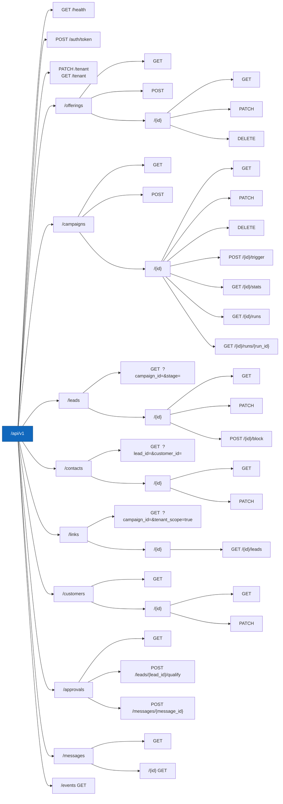
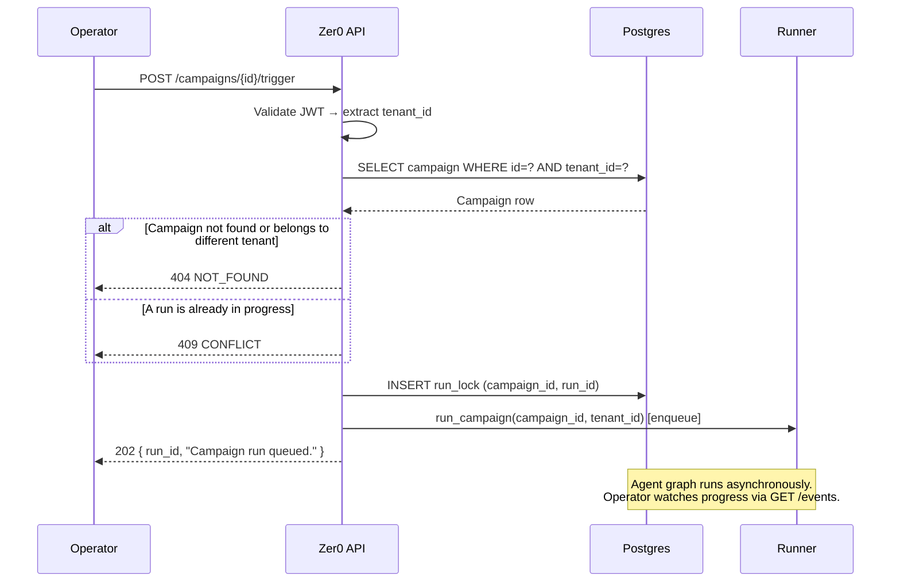
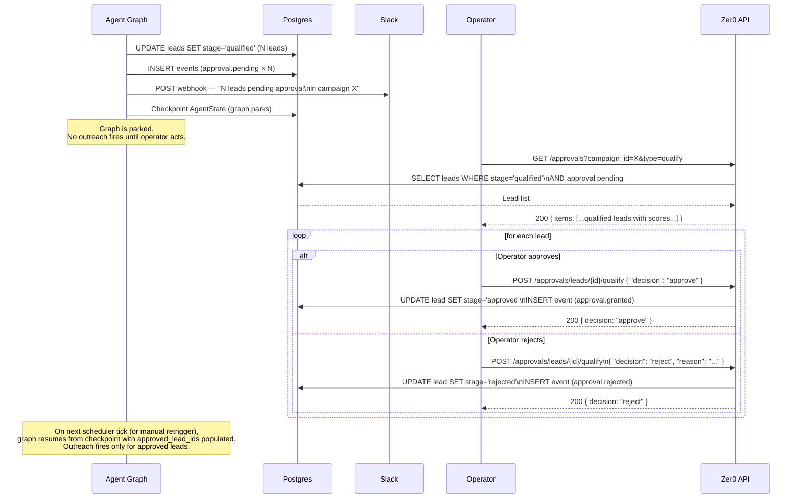
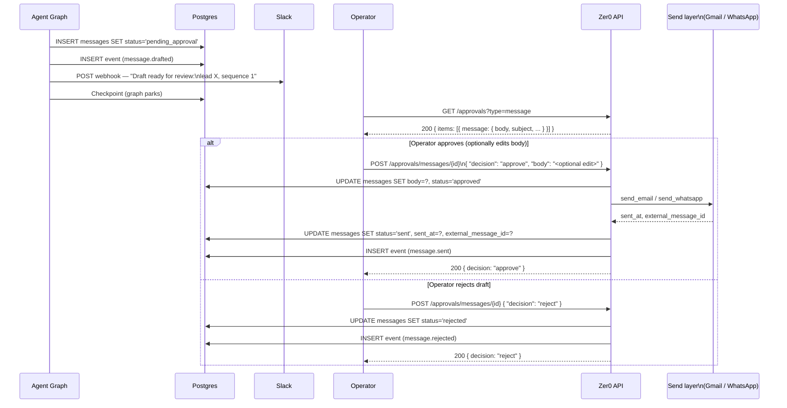

# API Design

Status: DRAFT

REST API contract for the Zer0 dashboard backend, implemented with FastAPI. This file is the canonical reference for all endpoints, request/response shapes, auth, and error handling.

---

## General conventions

- Base path: `/api/v1`
- All request and response bodies are JSON (`Content-Type: application/json`).
- All responses use a consistent envelope:
  ```json
  { "data": <payload or null>, "error": null }
  { "data": null, "error": { "code": "ERROR_CODE", "message": "human-readable" } }
  ```
- All list endpoints return:
  ```json
  { "data": { "items": [...], "next_cursor": "<opaque string or null>" } }
  ```
  Pagination is cursor-based. Pass `?cursor=<value>&limit=<n>` (default limit 50, max 200).
- Timestamps in responses are ISO 8601 UTC strings.
- All IDs are UUIDs.

---

## API resource map

All routes under `/api/v1`. Every route except `GET /health` and `POST /auth/token` requires a valid JWT.



---

Agent runs in a dedicated `ThreadPoolExecutor` (max workers configurable via `ZER0_RUNNER_MAX_WORKERS`, default 4). Uvicorn handler threads are **never** blocked by agent execution. Run status is tracked in `campaign_runs` (see data-model spec).

`POST /campaigns/{id}/trigger` returns `202` with `run_id` immediately. Status is polled via `GET /campaigns/{id}/runs/{run_id}`.

If a run with status `running` already exists for the campaign, the trigger endpoint returns `409 CONFLICT`.

---

## Sequence diagrams

### Auth: Google OAuth → Zer0 JWT

```mermaid
sequenceDiagram
    participant Browser as Dashboard\n(browser)
    participant Google  as Google OAuth
    participant API     as Zer0 API

    Browser  ->> Google  : Redirect to Google consent screen
    Google  -->> Browser : Authorization code (redirect_uri)
    Browser  ->> API     : POST /auth/token { code, redirect_uri }
    API      ->> Google  : Exchange code for access token\n(server-to-server)

    alt Exchange fails (invalid / expired code)
        Google  -->> API     : 400 error
        API     -->> Browser : 401 INVALID_CODE
    else Exchange succeeds
        Google  -->> API     : Google access token + id_token
        API      ->> API     : Look up or create tenant row\n(keyed by Google Workspace domain)
        API      ->> API     : Mint Zer0 JWT { tenant_id, sub, exp: +8h }
        API     -->> Browser : 200 { access_token, expires_at }
    end

    Note over Browser,API: All subsequent requests include<br/>Authorization: Bearer &lt;jwt&gt;
```

---

### Campaign trigger: manual run



---

### Approve-qualify flow (human approval gate)



---

### Approve-message flow



---

## Authentication

### Scheme

JWT Bearer tokens. Every request (except `GET /health` and `POST /auth/token`) must include:

```
Authorization: Bearer <token>
```

The JWT payload contains `tenant_id` and `sub` (user email). The API middleware extracts `tenant_id` and injects it as a dependency into every handler — no handler reads `tenant_id` from the request body.

Token lifetime: 8 hours. No refresh tokens in v1; re-authenticate to get a new token.

### `POST /auth/token`

Exchange Google OAuth code for a Zer0 JWT.

**Request:**
```json
{ "code": "<Google OAuth authorization code>", "redirect_uri": "<string>" }
```

**Response `200`:**
```json
{ "data": { "access_token": "<jwt>", "expires_at": "<ISO 8601>" }, "error": null }
```

**Errors:** `401 INVALID_CODE` if the Google OAuth exchange fails.

---

## Health

### `GET /health`

No auth required.

**Response `200`:**
```json
{ "data": { "status": "ok" }, "error": null }
```

---

## Tenant settings

### `GET /tenant`

Returns the current tenant record. Sensitive credential fields (`*_enc`) are **never** returned — only a boolean indicating whether the credential is configured.

**Response `200`:**
```json
{
  "data": {
    "id": "<uuid>",
    "name": "<string>",
    "google_oauth_configured": true,
    "whatsapp_configured": false,
    "slack_configured": true,
    "notification_rules": { "<event_type>": "<slack_channel>" },
    "retargeting_cooldown_days": 30,
    "default_approval_mode": "full_auto",
    "created_at": "<ISO 8601>"
  },
  "error": null
}
```

### `PATCH /tenant`

Update tenant settings. Only the fields you send are changed (partial update).

**Request** (all fields optional):
```json
{
  "name": "<string>",
  "google_oauth_token": "<plain token — encrypted before storage>",
  "whatsapp_api_key": "<plain key>",
  "slack_webhook_url": "<plain URL>",
  "notification_rules": { "<event_type>": "<channel>" },
  "retargeting_cooldown_days": 30,
  "default_approval_mode": "full_auto"
}
```

**Response `200`:** same shape as `GET /tenant`.

---

## Offerings

### `GET /offerings`

List all active offerings for the tenant.

**Query params:** `cursor`, `limit`.

**Response `200`:** list of offering objects (see shape below).

### `POST /offerings`

Create a new offering.

**Request:** full offering body (see shape below, minus `id`/`created_at`/`updated_at`).

**Response `201`:** created offering.

**Errors:** `422 VALIDATION_ERROR` if any required config field is missing or invalid.

### `GET /offerings/{id}`

**Response `200`:** single offering object.

**Errors:** `404 NOT_FOUND`.

### `PATCH /offerings/{id}`

Partial update. Only sent fields are changed. Takes effect on the next agent tick.

**Response `200`:** updated offering.

**Errors:** `404 NOT_FOUND`, `422 VALIDATION_ERROR`.

### `DELETE /offerings/{id}`

Soft-delete. Campaigns under this offering are also paused.

**Response `204`:** no body.

#### Offering object shape

```json
{
  "id": "<uuid>",
  "tenant_id": "<uuid>",
  "name": "<string>",
  "description": "<string>",
  "value_proposition": "<string>",
  "pain_points": ["<string>"],
  "discovery_config": {
    "sources": ["linkedin", "web"],
    "query_templates": ["<string>"],
    "geography": ["<string>"],
    "volume_per_run": 50
  },
  "icp": {
    "target_industries": ["<string>"],
    "target_roles": ["<string>"],
    "company_size_range": { "min": 10, "max": 500 },
    "geography": ["<string>"],
    "keywords": ["<string>"],
    "negative_keywords": ["<string>"]
  },
  "qualification_config": {
    "rubric_criteria": [
      { "name": "<string>", "description": "<string>", "weight": 0.4 }
    ],
    "score_threshold": 70,
    "disqualifying_signals": ["<string>"]
  },
  "outreach_config": {
    "channels_enabled": ["email"],
    "tone": "professional",
    "language_default": "en",
    "templates": {
      "first_touch": "<string>",
      "follow_up_1": "<string>",
      "follow_up_2": "<string>"
    },
    "follow_up_count": 2,
    "follow_up_spacing_days": 3,
    "send_schedule": "09:00-17:00 Mon-Fri"
  },
  "created_at": "<ISO 8601>",
  "updated_at": "<ISO 8601>"
}
```

---

## Campaigns

### `GET /campaigns`

**Query params:** `offering_id` (optional filter), `status` (optional filter), `cursor`, `limit`.

**Response `200`:** list of campaign objects.

### `POST /campaigns`

Create a campaign under an offering. Any Offering-level field can be overridden.

**Request:**
```json
{
  "offering_id": "<uuid>",
  "name": "<string>",
  "discovery_override": { "...partial DiscoveryConfig..." },
  "icp_override": { "...partial ICP..." },
  "qualification_override": { "...partial QualificationConfig..." },
  "outreach_override": { "...partial OutreachConfig..." },
  "schedule": "0 9 * * 1-5",
  "volume_cap": 100,
  "approval_mode": "approve_qualify"
}
```

All override fields are optional. `offering_id` is required.

**Response `201`:** created campaign object.

### `GET /campaigns/{id}`

**Response `200`:** single campaign object including its resolved config.

### `PATCH /campaigns/{id}`

**Response `200`:** updated campaign.

### `DELETE /campaigns/{id}`

Soft-delete. Running ticks for this campaign are allowed to complete.

**Response `204`.**

### `POST /campaigns/{id}/trigger`

Manually kick off a campaign run outside its cron schedule.

**Request:** empty body.

**Response `202`:**
```json
{ "data": { "run_id": "<uuid>", "message": "Campaign run queued." }, "error": null }
```

**Errors:** `409 CONFLICT` if a run is already in progress for this campaign.

#### Campaign object shape

```json
{
  "id": "<uuid>",
  "tenant_id": "<uuid>",
  "offering_id": "<uuid>",
  "name": "<string>",
  "discovery_override": null,
  "icp_override": null,
  "qualification_override": null,
  "outreach_override": null,
  "schedule": "0 9 * * 1-5",
  "volume_cap": 100,
  "approval_mode": "approve_qualify",
  "status": "active",
  "resolved_config": { "...full ResolvedConfig..." },
  "created_at": "<ISO 8601>",
  "updated_at": "<ISO 8601>"
}
```

The `resolved_config` field is computed on read (not stored) — it is the merged result of Offering defaults and Campaign overrides.

---

## Leads

### `GET /leads`

**Query params:** `campaign_id` (required), `stage` (optional), `cursor`, `limit`.

**Response `200`:** list of lead objects.

### `GET /leads/{id}`

**Response `200`:** single lead object with full enrichment data and message history.

### `PATCH /leads/{id}`

Operator-initiated overrides only. Accepted fields:

```json
{
  "stage": "<lead_stage>",
  "blocked": true
}
```

Setting `blocked: true` sets `blocked_at` and stops all outreach. `stage` allows manual pipeline position override.

**Response `200`:** updated lead.

**Errors:** `400 INVALID_TRANSITION` if the requested stage transition is not valid.

#### Lead object shape

```json
{
  "id": "<uuid>",
  "tenant_id": "<uuid>",
  "campaign_id": "<uuid>",
  "link_id": "<uuid | null>",
  "stage": "qualified",
  "company_name": "<string | null>",
  "domain": "<string | null>",
  "industry": "<string | null>",
  "headcount_range": "<string | null>",
  "business_type": "<string | null>",
  "research_summary": "<string | null>",
  "signals": ["<string>"],
  "score": 82.5,
  "per_criterion_scores": [{ "criterion": "<name>", "score": 85 }],
  "rationale": "<string | null>",
  "rejection_reason": null,
  "detected_language": "en",
  "blocked_at": null,
  "created_at": "<ISO 8601>",
  "updated_at": "<ISO 8601>"
}
```

Contact data (email, role, phone) is available via `GET /contacts?lead_id=<id>`.

---

## Approvals

Human approval gates. Only applicable when the campaign's `approval_mode` requires human review.

### `GET /approvals`

Returns all pending approval items for the tenant, across all campaigns.

**Query params:** `campaign_id` (optional), `type` (`qualify` | `message`), `cursor`, `limit`.

**Response `200`:**
```json
{
  "data": {
    "items": [
      {
        "id": "<uuid>",
        "type": "qualify",
        "campaign_id": "<uuid>",
        "lead": { "...lead object..." }
      },
      {
        "id": "<uuid>",
        "type": "message",
        "campaign_id": "<uuid>",
        "lead_id": "<uuid>",
        "message": { "...message object..." }
      }
    ],
    "next_cursor": null
  },
  "error": null
}
```

### `POST /approvals/leads/{lead_id}/qualify`

Approve or reject a lead at the qualify gate.

**Request:**
```json
{ "decision": "approve" }
```
or
```json
{ "decision": "reject", "reason": "<string>" }
```

**Response `200`:**
```json
{ "data": { "lead_id": "<uuid>", "decision": "approve" }, "error": null }
```

**Errors:** `404 NOT_FOUND`, `409 CONFLICT` if decision already made.

### `POST /approvals/messages/{message_id}`

Approve or reject a drafted message. Optionally edit the body before approving.

**Request:**
```json
{ "decision": "approve", "body": "<edited body — optional>" }
```

**Response `200`:**
```json
{ "data": { "message_id": "<uuid>", "decision": "approve" }, "error": null }
```

---

## Messages

### `GET /messages`

**Query params:** `lead_id` (optional), `campaign_id` (optional), `status` (optional), `cursor`, `limit`.

**Response `200`:** list of message objects.

### `GET /messages/{id}`

**Response `200`:** single message object with `config_snapshot`.

#### Message object shape

```json
{
  "id": "<uuid>",
  "tenant_id": "<uuid>",
  "campaign_id": "<uuid>",
  "lead_id": "<uuid>",
  "channel": "email",
  "subject": "<string or null>",
  "body": "<string>",
  "personalisation_notes": "<string>",
  "config_snapshot": { "...ResolvedConfig..." },
  "sequence_number": 1,
  "status": "sent",
  "sent_at": "<ISO 8601>",
  "external_message_id": "<string>",
  "created_at": "<ISO 8601>",
  "updated_at": "<ISO 8601>"
}
```

---

## Links

Raw discovery records — every URL found during a campaign run. Use this endpoint to inspect what the agent has discovered and whether it has been scraped and processed.

### `GET /links`

**Query params:** `campaign_id` (required), `cursor`, `limit`.

**Response `200`:** list of link objects.

#### Link object shape

```json
{
  "id": "<uuid>",
  "tenant_id": "<uuid>",
  "campaign_id": "<uuid>",
  "url": "<string>",
  "source": "web",
  "scraped_at": "<ISO 8601 | null>",
  "identified_at": "<ISO 8601 | null>",
  "created_at": "<ISO 8601>"
}
```

`page_text` is **never** returned in API responses — it can be megabytes large. Use the events log to inspect the outcome of the identify step.

`scraped_at: null` → page has not been fetched yet (or scrape failed).
`identified_at: null` → link has been scraped but `node_identify_leads` has not yet processed it, or processing failed. Links with `identified_at: null` are eligible for retry.

---

## Customers

Tenant-wide persistent company knowledge base. One record per `(tenant_id, domain)`. The agent writes here on every identify + research cycle; humans can patch `company_name`, `industry`, and `notes`.

### `GET /customers`

List all customer records for the tenant.

**Query params:** `cursor`, `limit`.

**Response `200`:** list of customer objects.

### `GET /customers/{id}`

**Response `200`:** single customer object with full research history.

**Errors:** `404 NOT_FOUND`.

### `PATCH /customers/{id}`

Human-override fields only. The agent never calls this endpoint; it is exclusively for operator correction and annotation.

**Accepted fields:**
```json
{
  "company_name": "<string>",
  "industry": "<string>",
  "headcount_range": "<string>",
  "business_type": "<string>",
  "notes": "<string>"
}
```

**Response `200`:** updated customer object.

**Errors:** `404 NOT_FOUND`, `422 VALIDATION_ERROR`.

#### Customer object shape

```json
{
  "id": "<uuid>",
  "tenant_id": "<uuid>",
  "domain": "<string>",
  "company_name": "<string | null>",
  "industry": "<string | null>",
  "headcount_range": "<string | null>",
  "business_type": "<string | null>",
  "research_summary": "<string | null>",
  "signals": ["<string>"],
  "notes": "<string | null>",
  "first_seen_at": "<ISO 8601 | null>",
  "last_enriched_at": "<ISO 8601 | null>",
  "created_at": "<ISO 8601>",
  "updated_at": "<ISO 8601>"
}
```

---

## Events

### `GET /events`

Paginated, filterable audit log.

**Query params:** `campaign_id`, `lead_id`, `event_type`, `from` (ISO date), `to` (ISO date), `cursor`, `limit`.

**Response `200`:** list of event objects.

#### Event object shape

```json
{
  "id": "<uuid>",
  "tenant_id": "<uuid>",
  "campaign_id": "<uuid or null>",
  "lead_id": "<uuid or null>",
  "event_type": "lead.qualified",
  "payload": { "...event-specific data..." },
  "config_snapshot": { "...ResolvedConfig or null..." },
  "created_at": "<ISO 8601>"
}
```

---

## Error codes

| HTTP status | Code                  | Meaning                                                     |
| ----------- | --------------------- | ----------------------------------------------------------- |
| 400         | `INVALID_REQUEST`     | Malformed request body or query param.                      |
| 400         | `INVALID_TRANSITION`  | Requested lead stage transition is not permitted.           |
| 401         | `UNAUTHORIZED`        | Missing or invalid JWT.                                     |
| 401         | `INVALID_CODE`        | Google OAuth code exchange failed.                          |
| 403         | `FORBIDDEN`           | Authenticated but not permitted (e.g. cross-tenant access). |
| 404         | `NOT_FOUND`           | Resource does not exist or belongs to a different tenant.   |
| 409         | `CONFLICT`            | State conflict (run in progress, decision already made).    |
| 422         | `VALIDATION_ERROR`    | Pydantic validation failed on a config body.                |
| 500         | `INTERNAL_ERROR`      | Unhandled server error.                                     |

All errors carry a `message` field with a human-readable explanation safe to show in the dashboard UI.
