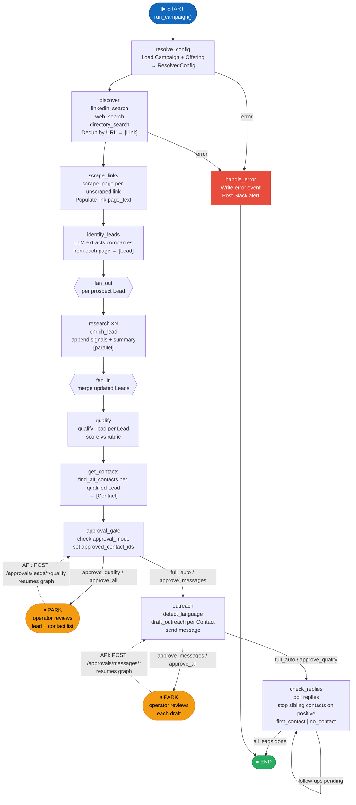
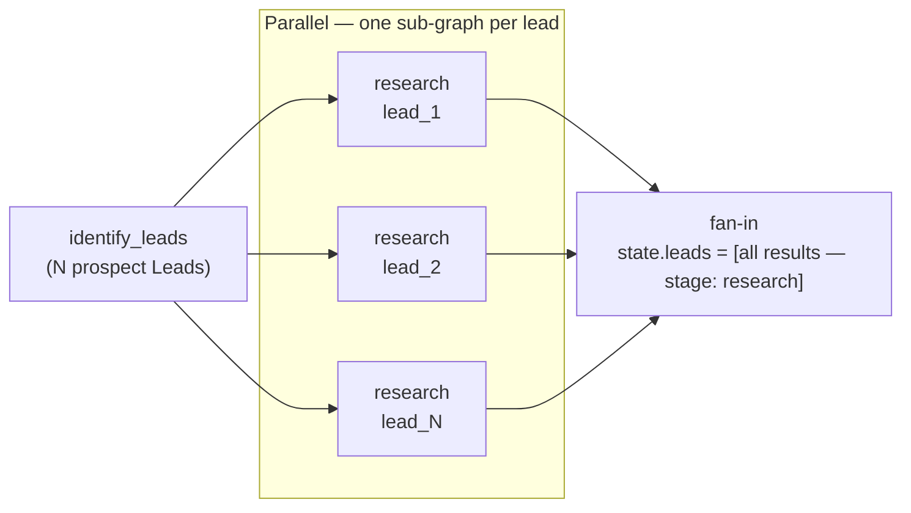
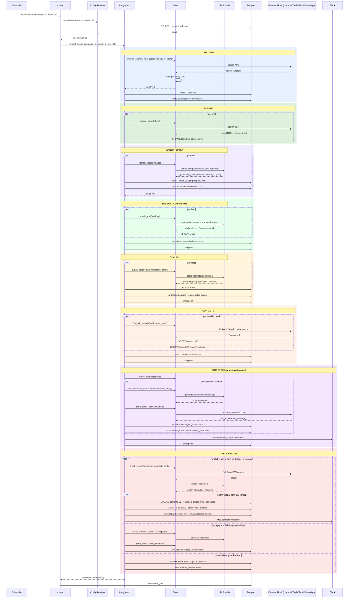

# Agent Graph

Status: DRAFT

LangGraph design for the Zer0 agent runtime. This file specifies the state schema, node contracts, edge conditions, and error handling strategy. The architecture overview in `spec/product/02-architecture.md` describes the control flow at a high level; this file specifies the implementation contract.

---

## Overview

The agent is a LangGraph `StateGraph`. One compiled graph is instantiated at application startup and reused. Each campaign run is a separate invocation — the graph is invoked with a fresh `AgentState` populated with the `ResolvedConfig` for that run.

---

## State schema

`AgentState` is a `TypedDict` (as required by LangGraph). All fields have defaults so the initial state is valid with only `run_id`, `campaign_id`, and `tenant_id` populated.

```python
class AgentState(TypedDict):
    # --- Identity ---
    run_id: str                          # UUID for this campaign run.
    tenant_id: str                       # Tenant scope.
    campaign_id: str                     # Campaign being run.
    config: ResolvedConfig               # Computed once at run start. Immutable.

    # --- Discovery ---
    links: list[Link]                    # Raw URLs discovered across all sources.

    # --- Lead pipeline ---
    leads: list[Lead]                    # Company entities extracted from links. Stage field tracks progress.

    # --- Contact pipeline ---
    contacts: list[Contact]              # People within qualified companies.

    # --- Approval gate ---
    pending_approval_lead_ids: list[str] # Leads whose contacts are waiting for human approval.
    approved_contact_ids: list[str]      # Contact IDs approved for outreach.

    # --- Outreach ---
    outreach_drafts: list[OutreachDraft]
    sent_messages: list[SentMessage]
    replies: list[Reply]

    # --- Run control ---
    error: str | None                    # Non-null if the run should abort.
    completed_lead_ids: list[str]        # Leads fully finished (first_contact or no_contact).
```

All mutations to `AgentState` happen inside node functions. No node reads from the database mid-run — all data flows through state. State is checkpointed to Postgres via LangGraph's checkpointer after each node completes.

---

## Nodes

Each node is a plain Python function with signature:

```python
def node_name(state: AgentState) -> dict:
    ...
    return {"field": new_value, ...}
```

The returned dict is merged into state. Nodes must not mutate the state dict in-place.

### `resolve_config`

- Reads `campaign_id` from state.
- Calls `ConfigResolver.resolve(campaign_id, tenant_id)` → `ResolvedConfig`.
- Returns `{"config": resolved_config}`.
- Aborts run with `{"error": "..."}` if campaign not found or config is invalid.

### `discover`

- Reads `config.discovery_config` and `config.icp`.
- Calls discovery tools in sequence: `linkedin_search`, `web_search`, `directory_search` — filtered to sources listed in `config.discovery_config.sources`.
- Deduplicates results by URL (against existing `links` rows for this campaign).
- Trims to `min(len(results), config.discovery_config.volume_per_run)`.
- Persists new `Link` rows to the database.
- Writes `lead.discovered` events for each new link.
- Returns `{"links": [...]}`.

### `scrape_links`

- Iterates `state.links` where `link.page_text is None`.
- For each: calls `scrape_page(link.url)` → cleaned text; updates `link.page_text` and `link.scraped_at`.
- Persists updated `Link` rows.
- Returns `{"links": [...]}` with page text populated.

### `identify_leads`

- Iterates `state.links` where `link.page_text is not None`.
- For each link: calls `identify_leads(link, config.icp)` → LLM extracts company entities from page text.
- Creates one `Lead` (stage `prospect`) per identified company. Deduplicates by `(campaign_id, domain)` — if a lead with the same domain already exists in the DB, skip creation.
- Persists new `Lead` rows; sets `lead.link_id`.
- Writes `lead.identified` events.
- Returns `{"leads": [...]}`.

### `research`

- Iterates `state.leads` where `lead.stage == 'prospect'`.
- For each lead: calls `enrich_lead(lead, config.icp)`.
  - Tool appends new signals to `lead.signals` (does NOT overwrite).
  - Tool appends new summary paragraph to `lead.research_summary` (does NOT overwrite).
  - Sets `lead.last_researched_at = now()`.
  - Sets `lead.stage = 'research'`.
- Persists updated `Lead` rows.
- Writes `lead.researched` events.
- Returns `{"leads": [...]}` with updated Lead objects.

### `qualify`

- Iterates `state.leads` where `lead.stage == 'research'`.
- For each lead: calls `qualify_lead(lead, config.qualification_config)`.
  - Sets `lead.score`, `lead.per_criterion_scores`, `lead.rationale`.
  - If `score >= threshold`: sets `lead.stage = 'qualification'`.
  - If `score < threshold` or disqualifying signal found: sets `lead.stage = 'rejected'`, `lead.rejection_reason`.
- Persists updated `Lead` rows.
- Writes `lead.qualified` or `lead.rejected` event per lead.
- Returns `{"leads": [...]}` with stage-updated leads.

### `get_contacts`

- Iterates `state.leads` where `lead.stage == 'qualification'`.
- For each lead: calls `find_all_contacts(lead, config.icp.target_roles)` → list of `Contact` objects.
- Persists new `Contact` rows for each result. Does not overwrite existing contacts.
- Sets `lead.stage = 'contacts'`.
- Writes `contacts.found` events.
- Returns `{"leads": [...], "contacts": [...]}` with leads stage-updated and contacts added.

### `approval_gate`

- Checks `config.approval_mode`.
- If `full_auto` or `approve_messages`:
  - Sets `approved_contact_ids = [c.id for c in state.contacts]`.
  - Sets `contact.approved_for_outreach = True` for all contacts.
  - Sets `lead.stage = 'outreach'` for all leads in state.
- If `approve_qualify` or `approve_all`:
  - For each lead, persists a `status = pending_approval` record and posts `approval.pending` event and Slack notification.
  - Returns `{"pending_approval_lead_ids": [...]}`.
  - The graph then **parks** (returns to the caller). A subsequent API call to `POST /approvals/leads/{id}/qualify` resumes the graph by updating `approved_contact_ids` and re-invoking.

### `outreach`

- Iterates `state.approved_contact_ids`, loading each `Contact` and its parent `Lead`.
- For each contact:
  - Calls `detect_language(lead)` to determine outreach language.
  - Calls `draft_outreach(lead, contact, config.outreach_config)` → `OutreachDraft`.
  - If `approval_mode` is `approve_messages` or `approve_all`:
    - Creates `messages` row with `status = pending_approval`.
    - Posts `approval.pending` event and Slack notification.
    - Parks until `POST /approvals/messages/{id}` resumes.
  - Otherwise: calls `send_email` or `send_whatsapp` based on `config.outreach_config.channels_enabled`.
  - Writes `message.drafted`, (optionally) `message.sent` events.
- Returns `{"outreach_drafts": [...], "sent_messages": [...]}`.

### `check_replies`

- Runs after `outreach`. Polls for replies via `check_replies` tool.
- For contacts with a positive reply:
  - Writes `reply.received`, `first_contact.triggered` events.
  - Posts Slack alert.
  - Sets `lead.stage = 'first_contact'` for the parent lead.
  - Sets `outreach_stopped = True` on all other `Contact` rows for the same lead.
  - Adds lead ID to `completed_lead_ids`.
- For contacts with no reply and remaining follow-ups still available: checks `follow_up_spacing_days` against `last sent_at`; sends next follow-up if due.
- For leads where all contacts are exhausted (no positive reply, max follow-ups reached): sets `lead.stage = 'no_contact'`; adds lead ID to `completed_lead_ids`.
- Returns `{"replies": [...], "sent_messages": [...], "completed_lead_ids": [...]}`.

### `handle_error`

- Called when `state.error` is non-null.
- Writes an `error` event to the audit log.
- Posts a Slack alert to the tenant's error channel (if configured).
- Terminates the run cleanly.

---

## Graph topology diagram

Full LangGraph topology. Dashed edges are conditional. `[P]` marks nodes that can park (return to `END`) and be resumed externally.



---

## Fan-out / fan-in: per-lead parallelism

Research runs in parallel across leads using LangGraph's `Send` API.



Each `research` sub-graph is an independent LangGraph `Send` invocation. They share no mutable state — each returns a partial dict that LangGraph merges via list-append reducers declared on `AgentState`.

Qualification, contact discovery, and outreach are similarly per-lead but implemented as sequential passes over `state.leads` (not parallel fan-out) — the volume is low enough that parallelism is not required in v1.

---

## End-to-end sequence: happy path (full_auto mode)



---

## Parallelism

The `research` node processes leads independently via LangGraph's `Send` API:

```python
# After identify_leads node:
def fan_out_research(state: AgentState) -> list[Send]:
    return [Send("research", {"lead": lead, "config": state["config"]}) for lead in state["leads"] if lead.stage == "prospect"]
```

Each `research` invocation returns `{"lead": updated_lead}`. The graph collector merges all results back into `state["leads"]`.

---

## Checkpointing

LangGraph's `PostgresSaver` is used as the checkpointer. Connection string sourced from `config.database_url` (never hardcoded).

Checkpoint key: `(tenant_id, campaign_id, run_id)`. This allows:
- Resumption after `approval_gate` parks.
- Recovery if the process crashes mid-run.
- Full replay of any historical run for debugging.

---

## Observability contract

Every node calls `observability.write_event(event_type, payload, config_snapshot, tenant_id, campaign_id, lead_id)` before returning. No node returns without writing at least one event.

Slack notifications are posted inside `observability.post_slack_event` — never directly in node code.

---

## Graph file layout

| File                      | Responsibility                                                 |
| ------------------------- | -------------------------------------------------------------- |
| `src/graph/state.py`      | `AgentState` TypedDict definition.                             |
| `src/graph/nodes.py`      | All node functions.                                            |
| `src/graph/edges.py`      | All conditional edge functions.                                |
| `src/graph/agent.py`      | Graph assembly: `StateGraph`, node registration, edge wiring, `compile()`. Must stay ≤ 50 lines. |
| `src/graph/runner.py`     | `run_campaign(campaign_id, tenant_id)` — the public entry point called by the scheduler and the `/campaigns/{id}/trigger` endpoint. |

---

## Implementation rules

1. `agent.py` stays ≤ 50 lines. Behaviour lives in `nodes.py` and `edges.py`.
2. Nodes are pure-ish: no I/O except via tools and `observability`. No direct DB access in nodes.
3. All tools used by nodes are imported from `src/tools/`. One file per tool.
4. `ResolvedConfig` is set once in `resolve_config` and never modified after that.
5. State fields are lists not dicts — LangGraph merges via the reducer declared in `AgentState`.
6. The graph is compiled once at startup. Recompilation is not allowed at runtime.
