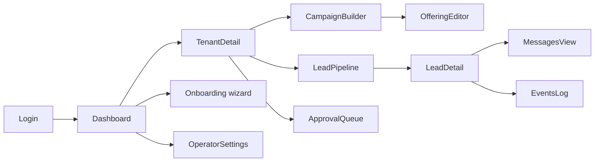
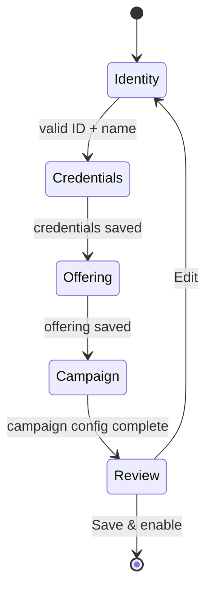
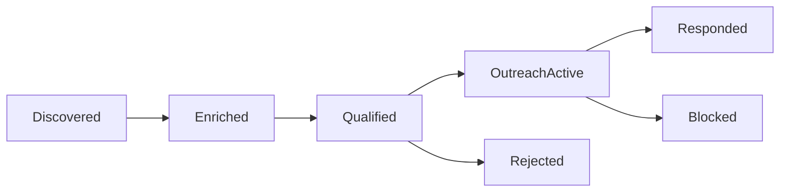

# UI Dashboard

**Status:** DRAFT

The operator web UI is the primary interface for Zer0. Every action a sales team operator needs — onboarding a tenant, wiring credentials, designing a campaign ICP, monitoring agent runs, reviewing outreach drafts, approving messages — is available here. The CLI ([`06-cli.md`](06-cli.md)) covers the same operations; the UI is a guided, browser-based layer over the same API.

---

## Audience

Operators only. Leads never interact with this UI. There is no lead-facing or tenant-facing endpoint.

---

## Hosting

`zer0 ui` (future CLI command — Phase 11) starts a process that:

- Serves the pre-built Next.js static export bundled inside the Python package.
- Exposes a JSON API under `/api/v1/` consumed by the frontend (the same FastAPI app as the main API).
- Binds to `127.0.0.1:8080` by default (loopback only).
- **Refuses to start** with a non-loopback `--host` unless `ZER0_UI_PASSWORD` is set in `config/.env`.

In v1, the UI process and the main application process share the same PostgreSQL database. They are independent — the UI does not talk to the application process directly.

---

## Tech stack

- **Backend:** FastAPI (Python) — the existing `api/` routes, same PostgreSQL DB.
- **Frontend:** Next.js 15 (static export), React 19, TypeScript 5, Tailwind CSS 4.
- **Build:** `npm run build` produces `ui/out/`. Output ships inside the Python package. Operators do not need Node.js installed.
- **Source:** `ui/` at repo root.

---

## Auth

Single operator password stored in `config/.env` as `ZER0_UI_PASSWORD`. Used to mint a short-lived JWT stored as an `httpOnly` session cookie.

- All routes (except `/login`) require an authenticated session.
- Secret credential fields are `type=password`, never pre-filled, never returned by the API after save. The API returns presence only: `"set"` or `"empty"`.
- If `ZER0_UI_PASSWORD` is not set and the host is loopback, the UI starts in **no-auth dev mode** (logged as a warning).
- All state-changing requests require the session cookie. CSRF tokens are not used — same-site cookie attribute provides the same protection for loopback.

These rules derive from [`../engineering/secret-hygiene.md`](../engineering/secret-hygiene.md). If they conflict, `secret-hygiene.md` is authoritative.

---

## Screen map

Every screen maps to one or more API endpoints. The underlying DB operations are identical to what the CLI does.

| Screen | API equivalent |
|---|---|
| Dashboard home | `GET /api/v1/tenants` + health summary |
| Tenant detail / pipeline view | `GET /api/v1/leads?campaign_id=...` |
| Tenant onboarding wizard | `POST /api/v1/tenants` → credentials → campaign |
| Campaign builder | `POST /api/v1/campaigns` / `PUT /api/v1/campaigns/{id}` |
| Offering editor | `POST /api/v1/offerings` / `PUT /api/v1/offerings/{id}` |
| Approval queue | `GET /api/v1/approvals` |
| Lead detail | `GET /api/v1/leads/{id}` |
| Messages view | `GET /api/v1/messages?campaign_id=...` |
| Events log | `GET /api/v1/events?tenant_id=...` |
| Operator settings | `GET /PUT /api/v1/settings` (operator-level) |

---

## Screens in detail

### Dashboard home

The first screen after login. Shows the operator a health summary and a list of every tenant.

Columns in the tenant table: **ID**, **Name**, **Tenants**, **Active Campaigns**, **Leads this week**, **Status** (`ok` / `degraded`).

A "New Tenant" button opens the onboarding wizard.

---

### Tenant onboarding wizard

Step-by-step guided flow. The tenant is created with `enabled = false`; the final step offers to enable it.

**Steps:**

1. **Identity** — Enter tenant display name. System generates a UUID. Fails if name is empty.
2. **Credentials** — Provide:
   - Gmail OAuth token (JSON blob — write-only field). Validated by attempting a `users.getProfile` call.
   - WhatsApp API key (write-only). Validated by attempting a `/messages` test ping.
   - Slack webhook URL (optional). Validated by sending a test message.
   - All fields are stored Fernet-encrypted. See [`03-tenancy.md`](03-tenancy.md#secrets).
3. **Offering** — Define what the tenant is selling:
   - `offering_name`, `value_proposition`, `pain_points` (text list).
   - Target ICP: `target_industries`, `target_roles`, `company_size_range`, `geography`, `keywords`.
4. **Campaign** — Create the first campaign:
   - Attach the offering just created.
   - Set `discovery_config` (sources enabled, query templates, geography, volume per run).
   - Set `qualification_config` (rubric criteria + weights, score threshold, disqualifying signals).
   - Set `outreach_config` (channels, tone, language, follow-up count + spacing).
   - Set `approval_mode` (full auto / approve messages / approve all).
5. **Review** — Summary of all inputs. Secrets shown as `••••••` (presence indicator). Edit links return to the relevant step.
6. **Save** — Writes `tenants`, `offerings`, `campaigns` rows. Stores credentials encrypted. Shows "Save & Enable" toggle.

---

### Lead pipeline view

The core operational screen per campaign. Shows all leads in their current stage with filtering and sorting.

- **Filter bar:** stage, date range, source (LinkedIn / web / directory), score range.
- **Lead row:** company name, website, stage badge, score (if qualified), last activity timestamp.
- **Trigger agent run button:** dispatches `POST /api/v1/campaigns/{id}/run` and shows a live progress indicator reading from `GET /api/v1/events?campaign_id=...`.

Clicking a lead row opens the lead detail drawer.

---

### Lead detail

Shows the full enrichment data, qualification scores, and message history for a single lead.

**Sections:**

- **Profile:** `company_summary`, `role_summary`, `detected_language`, contact details.
- **Qualification scores:** per-criterion breakdowns + total score + rationale.
- **Messages:** chronological list of sent/pending messages with channel badge, status, and body preview. Expandable to full body.
- **Replies:** inbound replies with sentiment badge (`positive` / `neutral` / `negative`).
- **Events:** filtered event log for this lead.

---

### Approval queue

Visible on the dashboard badge when any campaign has `approval_mode` set. Shows all messages in `pending_approval` state.

- Each row: lead name, company, channel, message body preview, recommended by agent.
- **Approve:** sets status to `approved`; agent sends on next tick.
- **Reject:** sets status to `rejected` with operator reason. No message is sent.
- **Edit & approve:** operator can modify the message body before approving (writes back to `messages.body`). Only allowed when status is `pending_approval`.

---

### Campaign builder

Full form for creating or editing a campaign. Field groups mirror `ResolvedConfig`:

- **Offering** (select from existing, or create inline via the offering editor).
- **Discovery config** (source toggles, query templates, geography, volume cap).
- **ICP** (industries, roles, size range, keywords, negative keywords).
- **Qualification rubric** (add/remove/reorder criteria; weight sliders that sum to 1.0; score threshold slider 0–100).
- **Outreach config** (channel toggles, tone, language, template text areas, follow-up count + spacing days, send schedule).
- **Approval mode** (select: full auto / approve messages / approve all).
- **Volume cap** and **schedule** (optional cron-style).

All field-level validation is real-time. The form only submits when the complete config is valid.

---

### Operator settings

Single screen for operator-level settings. Two sections:

1. **LLM configuration** — model name, max tokens, Anthropic API key (write-only presence field).
2. **Integration keys** — Tavily API key (write-only presence field), credential encryption key rotation (write-only; rotates the Fernet key and re-encrypts all tenant credentials atomically).

---

## Secret handling rules

These rules apply to all UI surfaces and are enforced at the API layer.

1. Secret inputs are `type=password` and are **never pre-filled**.
2. The API **never returns secret values** after save. Presence only: `"set"` or `"empty"`.
3. The browser **never stores secrets** in `localStorage`, `sessionStorage`, or cookies (only the session cookie, which is `httpOnly` and `SameSite=Strict`).
4. Secrets flow one direction only: operator → server. Never server → browser.

Derived from [`../engineering/secret-hygiene.md`](../engineering/secret-hygiene.md).

---

## Observability surface

The UI surfaces data already present in the DB. No new tables.

| Data | Source table |
|---|---|
| Tenant list + status | `tenants` |
| Campaign summaries | `campaigns` |
| Lead pipeline | `leads` |
| Messages + status | `messages` |
| Replies + sentiment | `replies` |
| Agent run events | `events` |
| Approval queue | `messages WHERE status = 'pending_approval'` |

No live log streaming in v1. The events log auto-refreshes every 10 seconds while a run is in progress (polling `GET /api/v1/events?campaign_id=...&since=<timestamp>`).

---

## Failure modes

| Failure | UI behaviour |
|---|---|
| API unavailable | Shows error banner. UI is read-only until connection restored |
| DB unreachable | API returns 503; UI shows "database unavailable" banner |
| Credential validation fails (onboarding) | Inline error on the credential field; wizard does not advance |
| Approval queue empty | Screen shows "No pending approvals" — not an error state |
| Non-loopback bind without `ZER0_UI_PASSWORD` | `zer0 ui` refuses to start with a clear error |

---

## Out of scope

- **Lead-facing or tenant-facing portal.** This dashboard is for operators only.
- **Hosted SaaS control plane.** Loopback by default.
- **Live streaming logs or Prometheus/Grafana dashboards.**
- **Per-operator user accounts.** Single operator password for v1.
- **Autonomous ICP suggestion.** The UI lets operators define ICP; the agent does not suggest ICP from the internet on its own.
- **Email inbox management.** Replies are visible in the lead detail; operators do not reply to leads from within Zer0 in v1.
